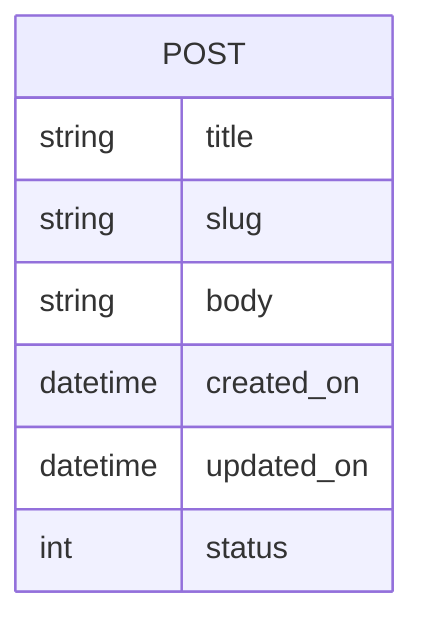

---
# Page title
title: The Blog Project

# Title for the menu link if you wish to use a shorter link title, otherwise remove this option.
linktitle: The Blog Project

# Date page published
date: 2021-03-23

# Academic page type (do not modify).
type: book

# Position of this page in the menu. Remove this option to sort alphabetically.
weight: 10

draft: False

# Featured image
# To use, place an image named `featured.jpg/png` in your page's folder.
# Placement options: 1 = Full column width, 2 = Out-set, 3 = Screen-width
# Focal point options: Smart, Center, TopLeft, Top, TopRight, Left, Right, BottomLeft, Bottom, BottomRight
# Set `preview_only` to `true` to just use the image for thumbnails.
image:
  placement: 1
  caption: "Python logo"
  focal_point: "smart"
  preview_only: false
  alt_text: Python logo

---

## المتطلبات

- [ ] يمكن للمدون النشر على المدونة حيث يظهر النص والعنوان ووقت النشر
- [ ] يمكن أن تكون مدونة وظيفة مشروع أو نشرها
- [ ] سيكون مشاركات المدونة عناوين ، عناوين URL للقراءة (تسمى الرخويات ويتم إنشاؤها من العنوان) ، وهي هيئة ، وسوف تظهر التاريخ والوقت الذي تم إنشاؤه وتحريره
- [ ] يمكن تحرير مدون بلوق وظائف ونظام سوف تظهر آخر مرة تم تحديثه
- [ ] سوف يعرض الموقع قائمة من blogposts مع ملخص للجسم
- [ ] يمكن للمستخدم اختيار وظيفة من قائمة بلوق وظائف لعرض التفاصيل
- [ ] افترض أن هناك مؤلف واحد لجميع بلوق الوظائف التي لا تتغير أبدا 

#### بعض النصائح المفيدة

- النظر في المتطلبات باعتبارها قائمة التحقق التي تقوم بفحصها في كل مرة تقوم فيها بإكمال واحدة. عندما تكون قد أكملت جميع المتطلبات، يكتمل مشروعك. 
- بالنسبة لمعظم المتطلبات، سوف تمر عبر العملية الموضحة في [عملية تطوير جانغو]()

## ER-Diagram

يصف مخطط التقارير الإلكترونية متطلبات البيانات وسيتم استخدامه لإنشاء نماذج بيانات المشروع في models.py. نموذج بيانات المدونة بسيط جدا حاليا ويحتوي على كيان واحد:

## كيفية متابعة هذا المشروع

أولا، إنشاء repl عن طريق الاستيراد من الريبو github **malmarz/isom350-blog** كما هو موضح هنا:



ثم، بمجرد إنشاء المشروع، يمكنك بسهولة عرض خطوة التنفيذ عن طريق التبديل إلى فرع approriate. على سبيل المثال، لمشاهدة التعليمات البرمجية لتنفيذ خطوة نموذج البيانات في التطوير، يمكنك التبديل إلى فرع نموذج البيانات من خلال التحكم بالإصدار كما هو موضح هنا:



وبالمثل يمكنك التبديل إلى الخطوة المناسبة لمعرفة كيفية تنفيذها.
يرجى ملاحظة أنه يجب عليك تنفيذ نفس الخطوة بنفسك لمعرفة كيفية تطوير تطبيقات الويب. انتقل إلى فرع الحل للتحقق من الحل ومعرفة كيف كان بإمكانك القيام بذلك بشكل صحيح.

### كيفية محاولة إنشاء المشروع بنفسك.

1. إنشاء repl جديد يستند إلى **Django Template**.
2. محاولة بناء المشروع من خلال استكمال [المتطلبات المذكورة هنا]()
3. إذا كان عالقا، افتح مشروع الحل وقارنه بعملك
4. محاولة قراءة [Django وثائق المشروع](https://docs.djangoproject.com/en/3.1/) والتفكير في طرق لتحسين تطبيق الويب الخاص بك وراء المتطلبات.
5. لا تتردد في عرض عملك للآخرين من خلال مشاركة عنوان URL الاختبار لمشروعك. فقط تأكد من أن خادم اختبار Django قيد التشغيل ، وإلا فلن يتمكنوا من اختبار تطبيق الويب الخاص بك.

