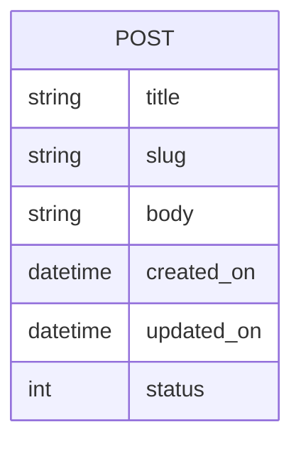

---
# Page title
title: The Blog Project

# Title for the menu link if you wish to use a shorter link title, otherwise remove this option.
linktitle: The Blog Project

# Date page published
date: 2021-03-23

# Academic page type (do not modify).
type: book

# Position of this page in the menu. Remove this option to sort alphabetically.
weight: 10

draft: False

# Featured image
# To use, place an image named `featured.jpg/png` in your page's folder.
# Placement options: 1 = Full column width, 2 = Out-set, 3 = Screen-width
# Focal point options: Smart, Center, TopLeft, Top, TopRight, Left, Right, BottomLeft, Bottom, BottomRight
# Set `preview_only` to `true` to just use the image for thumbnails.
image:
  placement: 1
  caption: "Python logo"
  focal_point: "smart"
  preview_only: false
  alt_text: Python logo

---

## Requirements

- [ ] يمكن لـ Blogger النشر على مدونة حيث يتم عرض النص والعنوان ووقت النشر
- [ ] قابلة للنشر يمكن أن تكون مشاركة المدونة مسودة أو 
- [ ] ستحتوي منشورات المدونة على عناوين ، وعناوين URL قابلة للقراءة (تسمى الرخويات ويتم إنشاؤها من العنوان) ، ونص ، وستعرض تاريخ ووقت إنشائها وتحريرها    .  
- [ ] يمكن لـ Blogger تعديل منشورات المدونة وسيعرض النظام آخر مرة تم تحديثه فيها
- [ ] سيعرض الموقع قائمة بالمدونات مع ملخص للنص
- [ ] يمكن للمستخدم اختيار منشور من قائمة منشورات المدونة لعرض التفاصيل
- [ ] افترض أن هناك مؤلفًا واحدًا لجميع منشورات المدونة التي لا تتغير أبدًا

#### Some Useful Tips

- ضع في اعتبارك المتطلبات كقائمة مراجعة تقوم بفحصها في كل مرة تنتهي من متطلب واحد. عند الانتهاء من جميع المتطلبات ، يكون مشروعك قد اكتمل.
- بالنسبة لمعظم المتطلبات ، ستبحث عن العملية في ملف [Django Development Process]()

## ER-Diagram

يصف مخطط ER- متطلبات البيانات وسيتم استخدامه لإنشاء نماذج بيانات المشروع في Models.py. نموذج بيانات المدونة حاليًا بسيط جدًا ويحتوي على كيان واحد:

## How To Follow Along This Project

أولاً ، قم بإنشاء repl عن طريق الاستيراد من github repo **malmarz/isom350-blog**  كما هو موضح هنا::



بعد ذلك ، بمجرد إنشاء المشروع ، يمكنك بسهولة عرض خطوة التنفيذ عن طريق التبديل إلى الفرع المناسب. على سبيل المثال ، لمشاهدة الكود لتنفيذ خطوة نموذج البيانات في التطوير ، يمكنك التبديل إلى فرع نموذج البيانات من خلال التحكم في الإصدار كما هو موضح هنا:



وبالمثل ، يمكنك التبديل إلى الخطوة المناسبة لمعرفة كيفية تنفيذها.

يرجى ملاحظة أنه يجب عليك محاولة تنفيذ نفس الخطوة بنفسك لمعرفة كيفية تطوير تطبيقات الويب. قم بالتبديل إلى فرع الحل للتحقق من الحل الخاص بك ومعرفة كيفية القيام بذلك بشكل صحيح.

### محاولة بناء المشروع بنفسك.

1. قم بإنشاء repl باعتماد ال جديد   **Django Template**.
2. حاول بناء المشروع من خلال استكمال [المتطلبات المدرجة هنا]
()
3. إذا تعثرت ، افتح مشروع الحل وقارن بعملك
4. حاول قراءة ملف [Django Project Documentation](https://docs.djangoproject.com/en/3.1/) وفكر في طرق لتحسين تطبيق الويب الخاص بك بما يتجاوز المتطلبات.

5. لا تتردد في إظهار عملك للآخرين من خلال مشاركة عنوان URL للاختبار لمشروعك. فقط تأكد من تشغيل خادم اختبار Django ، وإلا لن يتمكنوا من اختبار تطبيق الويب الخاص بك.

