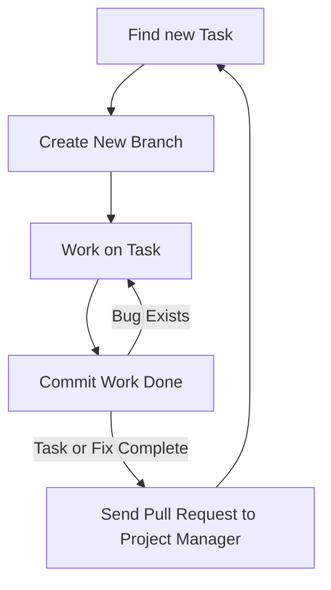

---
# Page title
title: Development Collaboration

# Title for the menu link if you wish to use a shorter link title, otherwise remove this option.
linktitle: Collaboration

# Date page published
date: 2021-03-23

# Academic page type (do not modify).
type: book

# Position of this page in the menu. Remove this option to sort alphabetically.
weight: 3

draft: False

---

العمل بشكل فعال كفريق هي احدى الجوانب الاكثر صعوبة في تطوير البرامج.
تكون هذه المشكلة اكبر بالنسبة للمبرمجين عديمي الخبرة لأن طريقة نظام النص التشفيري للبرنامج ستؤثر على مدى تعامل اعضاء الفريق مع بعضهم البعض.
لحسن حظنا، نحن نستخدم "جانقو"، لقد تم تنظيم طريقة عمل نظام الشفرة مسبقاً، مشاريع "جانقو" منظمة لكي نستغل ال “OOP” و نتمكن من العمل كفريق بشكل فعال. 

ويبقى السؤال: كيف لأعضاء الفريق أن يتعاملوا مع بعضهم و يجمعوا النص التشفيري الى نص موحد. 

هناك طريقتين للتعاون أو للعمل كفريق:

# 1- التعاون المتزامن 

في التعاون المتزامن عبر الانترنت، أعضاء الفريق المتعاون يقومون بالعمل على نفس الملف في نفس الوقت مع بعضهم البعض،
تسهل هذه العملية خلال موقع “repl.it” و تتطلب فقط إرسال رابط الملف الى اعضاء الفريق، موقع “repl.it” يقوم بعمل فعال في التعاون المتزامن حيث أنه يسمح لأعضاء المجموعة أن يعملوا على ملف واحد في آن واحد وأن يتواصلوا مع بعضهم خلال العمل.

مع ذلك، هذا النوع من المشاركة محدود:
١. يتطلب جدول منسق
٢. عدد المشاركين محدود، من المنطقي أن يعمل فردان في وقت واحد 
٣. مساهمة الأفراد غير متابعة 
٤. ممكن أن تتطلب خبرة فرد من الأفراد لتتم عملية المشاركة بنجاح

الفائدة الأساسية للمشاركة المتزامنة عبر الانترنت هي مشاركة العلم. 
يعمل المساهمين على حل المشاكل و في النهاية يستفيد الفرد الأقل خبرة بشكل كبير من أعضاء الفريق الآخرين، التعاون المتزامن مشابه ل”eXprogramming” نوعا ما.

## كيفية استخدام التعاون المتزامن على موقع Replit.com؟

هناك طريقتان رئيسيتان:

1. قم بإنشاء فريق 
repl كجزء من
[فريق MISCBA على replit.com]
 يسمى **repl متعدد اللاعبين**
(https://replit.com/team/miscba)



ثم شارك عنوان ال url من المتصفح:



2. بدلا من ذلك، يمكنك إنشاء 
repl 
عادي مع إضافة متعاونين باستخدام زر المشاركة:



# 2- Asynchronous Collaboration

في التعاون الغير متزامن، أفراد المجموعة بإمكانهم العمل على المشروع في وقتهم الخاص ولا حاجة للتفاعل مباشرة مع اعضاء المجموعة،
بدلاً من ذلك، يتم استخدام نظام لإدارة كيفية قيام كل عضو بتغيير نص المشروع ولتمكين دمج العمل من أعضاء متعددين في نص واحد، هذه هي الطريقة الأكثر فعالية والأكثر استخداماً للتعاون في البرمجة، النظام الأكثر شيوعاً في الوقت الحالي لأدارة العمل المتزامن هو “git” الذي يوفره موقع “github”.

سيتطلب استخدام git أو github من المطورين تعلم أداة جديدة قد لا يكون من السهل تعلمها في البداية. ولكن بمجرد استخدام المطورين للأداة بشكل صحيح ، من الممكن تمكين تعاون آلاف المطورين في مشروع واحد ، كما يمكن رؤيته في [مشروع لينوكس كيرنال]
(https://github.com/torvalds/linux).

لحسن الحظ، يتكامل موقع 
replit.com 
جيداً مع 
github، 
سنستخدم ميزات 
git
الرئيسية من داخل 
replit.com،
وبالنسبة للمهام الأخرىمثل دمج وحل المشاكل والتعارضات،
سنستخدم واجهة الويب التي يوفرها
github.com
لأداء هذه المهام المتعلقة بالتعاون.

استخدام github
لا يكفي للتعاون بشكل فعال، لكي تكون فعالة يجب استيفاء الشروط التالية: 
1. تم تنظيم الكود لتمكين التعاون (يفرض Django ذلك على المشروع بالطريقة التي ينظم بها الكود)
2. يجب أن يتفق الفريق على سير عمل يصف كيف سيبدأ كل عضو العمل ، وما يجب العمل عليه ، وكيفية مشاركته عند الانتهاء.
3. يجب على جميع أعضاء الفريق الالتزام بسير العمل عند الترميز  للمشروع.
## سير العمل

سيكون لكل فريق مسار عمل خاص به ، ولذا فإننا نوصي بمسار عمل لتستخدمه في هذه الدورة التدريبية. سير العمل كما يلي:

** يمكن أن تكون المهمة ** إنشاء ميزة جديدة أو إصلاح خطأ موجود. يصف مسار العمل الطريقة التي يجب أن يتصرف بها المطورون عند العمل في مهمة. الخطوات الرئيسية هي:

{}
 لمعرفة الخطوات التي نفذت على GitHub
 معرفة الخطوات التي نفذت على Replit.com
{}

1.  ** ابحث عن مهمة أو إصلاح للعمل عليها: ** تقع على عاتق مدير المشروع مسؤولية التأكد من أن المطورين يمكنهم العثور على المهام للعمل عليها. يمكن العثور عليها مدرجة في مشكلات GitHub أو نظام التذاكر المستخدم للمشروع أو التحدث إلى مدير المشروع أو قراءة مستند المتطلبات. بالنسبة لهذه الدورة التدريبية ، يجب على مديري المشاريع كتابة المهام على أنها مشكلات في GitHub. يمكن للمطورين أيضًا المساعدة عن طريق كتابة المشكلات التي يمكنها إما تحوير اقتراحات الميزات أو أوصاف الأخطاء التي تحتاج إلى إصلاح. سنناقش إدارة المشروع بمزيد من التفصيل في [القسم التالي] ().
2.  ** استورد مشروعك من GitHub ** كما هو موضح في الشكل. من الجيد أيضًا استيراد نفس المشروع مرة أخرى في كل مرة تريد فيها بدء عمل جديد لضمان حصولك على نسخة جديدة من الكود.

   - ** هام: سحب التحديثات للمشاريع الحالية: ** إذا كنت لا تريد استيراد المشروع مرة أخرى وفقد عملك عند إعادة التثبيت ، فتأكد من ** سحب ** التحديثات التي تم دمجها في الفرع الرئيسي من قبل مدير المشروع على جيثب. سيضمن هذا أن تبدأ عملك بأحدث إصدار من الكود

3.  ** إنشاء فرع جديد: ** تسمح الفروع للمطور بتغيير الكود دون خوف من إفساد المشروع. عند البدء في مهمة برمجة ، قم دائمًا بإنشاء فرع git جديد للمهمة من الفرع الرئيسي. الفرع يسمح لك بتغيير الكود لك فقط ، ولا يؤثر على عمل الآخرين. عليك أن تتذكر دائمًا ما يلي:
    - ** أبدا العمل مباشرة في الفرع الرئيسي **.
    - ** انشاء فرع جديد ** من الفرع الرئيسي فقط.
    - يجب أن يكون لدى الفرع الرئيسي ** دائمًا ** نسخة عمل من المشروع ، وليس نسخة مكسورة أبدًا.
    - ** اختر اسمًا ** للفرع الجديد يعكس العمل المنجز. على سبيل المثال bug_1234 ، حيث يكون الرقم هو رقم الإصدار على جيثب. أو feature_1234. للتعرف على الأحرف المسموح بها في اسم الفرع [يرجى قراءة هذه المقالة](https://git-scm.com/docs/git-check-ref-format).



4.  ** العمل على المهمة **: تأكد من أن المهمة التي تعمل عليها صغيرة وبسيطة. إذا كانت هناك مهام كبيرة ومعقدة ، فقسِّمها إلى مهام أصغر.
5.  ** الالتزام بالمهمة **: عند الانتهاء من المهمة ، أو الوصول إلى مرحلة رئيسية في عملك ، يجب عليك الالتزام بالعمل. سيسمح لك هذا بإنشاء لقطة للعمل الذي قمت به ليتم تخزينه في سجل github. ميزة الحصول على لقطة الالتزام هي أنه يمكنك العودة إلى هذا الإصدار من الكود في أي وقت. لذلك ، يوصى بالالتزام بشكل متكرر وحتى لإجراء تغييرات صغيرة. فقط تأكد عندما تلتزم أنك تكتب رسالة مفيدة للتاريخ لمعرفة ما فعلته في هذا الالتزام. يجب عليك دائمًا الالتزام بعملك واختباره والاستمرار في تغيير الكود والالتزام حتى تتأكد من أن التغييرات التي أجريتها مقبولة واكتمال المهمة.
   
6.  ** أرسل طلب سحب **: إذا كنت متأكدًا من اكتمال المهمة ، فاستخدم github لإرسال طلب سحب. يخبر طلب السحب مدير المشروع أن العمل في هذا الفرع مكتمل وجاهز لإضافته إلى الفرع الرئيسي. تقع على عاتق مدير المشروع مسؤولية الاستجابة لطلب السحب ودمجه في الفرع الرئيسي. يمكن أن يكون طلب السحب هو دمج فرعين من نفس المستودع ، كما سنفعل في الغالب في هذه الدورة. هذا هو الحال بالنسبة لأعضاء الفريق الذين يعملون على نفس الريبو:


يمكن استخدامه أيضًا لطلب دمج الفروع بين افرع متشعبة والسماح لك بإرسال عملك إلى مشروع لست عضوًا فيه:


بمجرد إنشاء طلب سحب ، يمكن لمدير المشروع وأعضاء الفريق مناقشة طلب السحب هذا ومعرفة ما تم القيام به حتى الآن بواسطة مدير المشروع فيما يتعلق بالمسألة.



يُتوقع من الجميع اتباع هذه الخطوات عندما تعمل على مشاريع تطوير في هذه الدورة. قد يبدو الأمر وكأنه عبء في البداية ، ولن ترى الفوائد على الفور. ومع ذلك ، فإن الهدف هو جعلك تتدرب على كيفية البرمجة كجزء من فريق. لذلك عندما تبدأ مشروعك النهائي ، ستبدأ في رؤية فوائد سير العمل هذا.

## Git و GitHub

اعلم أن الأداة التي نستخدمها للتعاون غير المتزامن تُعرف باسم ** Git **. يسمح للمطورين بتتبع جميع التغييرات التي تم إجراؤها على مشاريعهم. يمكن استخدامه على كمبيوتر المطور باستخدام سطر الأوامر أو تطبيق سطح المكتب GitHub. يمكنك استخدامه بدون جيثب.

GitHub هو النظام الأساسي السحابي الذي يستضيف خدمات Git. إنها منصة وسائط اجتماعية للمطورين مبنية حول تطبيق Git. نظرًا لأن Git مفيد جدًا للمطورين ، يتم استضافته على نظامهم الأساسي ليستخدمه الجميع مجانًا ، بشرط أن يجعلوا مستودعاتهم عامة. يمكنك دفع اشتراك إذا كنت ترغب في الحصول على مستودعات خاصة. علاوة على ذلك ، أنشأ GitHub مجموعة من أدوات إدارة المشاريع وأدوات الترميز الاجتماعي حول Git. لا تعد المشكلات والفصول الدراسية والمشاريع وطلبات السحب وملفات تعريف المطورين جزءًا من Git ، ولكن تمت إضافتها خصيصًا لـ GitHub ولجعل الترميز أكثر اجتماعية. سنستخدم العديد من هذه الميزات لتحسين التعاون ولأغراض إدارة المشروع.

هناك العديد من المصطلحات التي يجب أن تكون على دراية بها لاستخدام Git و GitHub بشكل فعال. نلخصها في الجدول التالي. يحدد المجال ما إذا كان هذا المصطلح خاصًا بتطبيق Git أو تم تقديمه كجزء من الميزات الاجتماعية الإضافية التي أنشأها GitHub:
### Git و GitHub Terminology

| **Term** | **Domain** | **Meaning** |
| --- | --- | --- |
| **Repo/Repository** | Git | المستودع هو المكان الذي يوجد فيه كود المصدر وسجل جميع الإجراءات والتغييرات التي تم إجراؤها عليه. يوجد ريبو محلي على كمبيوتر المطور وهو مطلوب للمطور للقيام بالعمل. الريبو البعيد هو الموجود على جهاز آخر. يتم استضافة GitHub repo على GitHub لجعله متاحًا للمطورين الآخرين ويعتبر بمثابة مستودع بعيد لجميع المطورين. |
| **Clone** | Git | إنشاء نسخة محلية من الريبو. يمكن أن يكون الريبو المنسوخ بعيدًا أو محليًا |
| **Fork** | GitHub | يشبه الاستنساخ ولكنه يحدث على خوادم GitHub. يتم إنشاء GitHub repo كنسخة من مستودع GitHub آخر. سيحتوي الريبو الجديد على مساحة المشروع الخاصة به ، بما في ذلك المشكلات ومواقع wiki والمناقشات. |
| **Commit** | Git | في CVCS ، الالتزام هو عملية نشر التغييرات ، التي يتم إجراؤها محليًا ، إلى الريبو المركزي. بالنسبة لـ Git ، من تعليمات Git أن تأخذ لقطة من قاعدة التعليمات البرمجية في حالتها الحالية. يشار إلى اللقطة بالمراجعة. سيؤدي الالتزام بقاعدة الشفرة إلى إنشاء المراجعة محليًا. لنقل المراجعة إلى مستودع آخر ، يجب على المطور المحلي دفعها ، أو يجب على مطور خارجي سحبها.|
| **Rev/Revision** | Git | لقطة من قاعدة التعليمات البرمجية مأخوذة بواسطة أمر التنفيذ. يتم تمثيل المراجعة بواسطة سلسلة SHA1 الفريدة لتلك المراجعة. يمكن للمطور التبديل إلى أي حالة سابقة لقاعدة التعليمات البرمجية ، سواء كانت كاملة أو كملف واحد ، من خلال الرجوع إلى رقم المراجعة. |
| **Checkout** | Git | إجراء لإعادة قاعدة التعليمات البرمجية أو ملف أو مجموعة ملفات إلى مراجعة معينة |
| ** فرع ** | بوابة | إنشاء نسخة مُسماة من الكود المصدري المُستضاف في مستودع يسمح للمطور بالتجربة وإجراء تغييرات على الكود المصدري وإلزامهم بإنشاء مراجعات جديدة. يمكن للمطور حذف الفرع إذا لم يكن راضيًا عن العمل وتجاهل جميع المراجعات التي تم إجراؤها في الفرع ، أو يمكن للمطور دمج الفرع في الفرع الرئيسي ، وبالتالي جعل المراجعات الجديدة جزءًا من الرئيسي. |
| **Master branch** | Git | يستخدم الفرع الرئيسي لاستضافة جميع الكود الذي تم قبوله (النسخة الرئيسية). لا يعمل المطورون عادةً على الفرع الرئيسي مباشرةً ولكن ينشئون فروعًا بديلة للعمل عليها ، ثم يدمجون تغييرات التعليمات البرمجية المقبولة فيه. عندما يحتاج المطورون إلى البدء بنسخة جديدة من قاعدة التعليمات البرمجية ، فإنهم عادةً ما يتفرعون عن النظام الرئيسي. |
| **Merge** | Git | يُعرف الجمع بين المراجعات من فرعين مختلفين باسم الدمج. يتم إجراؤه تلقائيًا عند سحب الفروع أو دفعها. يمكن أن يتم الدمج بسلاسة وبشكل تلقائي إذا لم يكن هناك تعارض بين المراجعات. يُعرف هذا باسم دمج التقديم السريع. إذا كانت المراجعات المجمعة متعارضة ، فيجب على المطور حل التعارض في جميع الملفات يدويًا ، ثم إجراء الدمج بشكل صريح. |
| **Conflict** | Git | يحدث التعارض عندما تقوم مراجعتان بتغيير نفس السطر ، ولا يمكن دمج هذه التغييرات. سوف يبرز Git هذه الخطوط للمطور ويتضمن كلا السطرين من كل مراجعة حتى يتمكن المطور من عرضها جنبًا إلى جنب والجمع بينهما يدويًا. بمجرد حل جميع الملفات التي تحتوي على مثل هذه التعارضات وحفظها ، يجب على المطور إصدار أمر دمج يدويًا لـ Git لقبول حل التعارض. |
| **Push** | Git | إجراء من شأنه أن يسمح للمطور بسحب المراجعات من فرع آخر إلى الفرع الذي يعمل عليه المطور حاليًا. يتم فقط نقل المراجعات الفريدة للفرع الذي يتم سحبه منه إلى فرع العمل. لا يجب أن تكون الفروع في نفس الريبو. يمكن للمطور سحب فرع من الريبو البعيد. لا يمكن إجراء الدفع إذا كان هناك تعارض بين فرع العمل والفرع البعيد. يجب على المطور سحب الفرع البعيد أولاً ، وحل أي تعارض ، ثم دفع المراجعات المدمجة. |
| **Pull** | Git | إجراء من شأنه أن يسمح للمطور بإرسال مراجعات إلى فرع من الفرع الذي يعمل عليه المطور حاليًا. يتم إرسال المراجعات الفريدة لفرع العمل فقط إلى الفرع الآخر. يمكن أن يكون الفرع الذي يتم دفعه في الريبو المحلي أو الريبو البعيد. |
| **Pull Request** | GitHub | عمل شاع بواسطة GitHub. للسحب من فرع بعيد ، يحتاج المطور إلى معرفة عنوان الآلة البعيدة. قام GitHub بتبسيط هذه العملية من خلال السماح للمطور بمراجعات جديدة بإرسال طلب من الريبو الخاص به إلى مستودع آخر على GitHub. سيتضمن الريبو معلومات عن العنوان والفرع المطلوب السحب منه. يمكن للمطور الذي يتلقى طلب السحب عرض التغييرات وإجراء محادثة حولها وقبولها أو رفضها. إذا تم قبول التغييرات ، يتم دمجها في الريبو الذي تم إرسال طلب السحب إليه. |
| **Upstream** | Git | سلسلة المستودعات البعيدة التي تم نسخ الريبو الحالي منها. يتطلب دفع الكود إلى أعلى مجهودًا ، حيث يجب القضاء على التعارض. عادةً ما يتم إرسال طلبات السحب إلى المستودعات في المنبع. |
| **Downstream** | Git | شبكة جميع المستودعات التي تم استنساخها من الريبو الحالي. تتدفق التعليمات البرمجية دون عناء ، حيث يتم تفويض مسؤولية حل التعارض إلى المطورين في المصب عندما ينسحبون من الريبو الحالي. |

