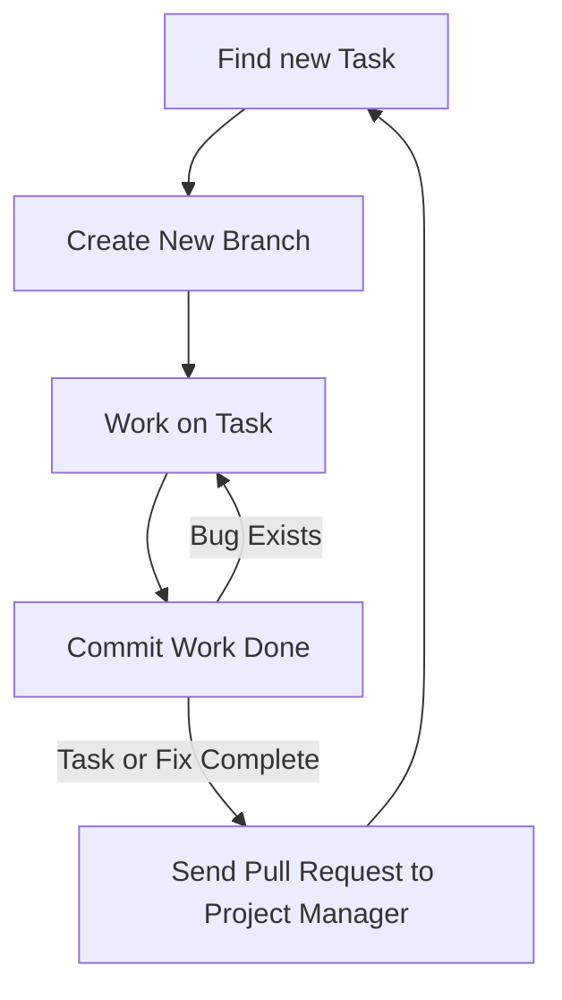

---
# Page title
title: Development Collaboration

# Title for the menu link if you wish to use a shorter link title, otherwise remove this option.
linktitle: Collaboration

# Date page published
date: 2021-03-23

# Academic page type (do not modify).
type: book

# Position of this page in the menu. Remove this option to sort alphabetically.
weight: 3

draft: False

---

العمل بشكل فعال كفريق هي احدى الجوانب الاكثر صعوبة في تطوير البرامج.
تكون هذه المشكلة اكبر بالنسبة للمبرمجين عديمي الخبرة لأن طريقة نظام النص التشفيري للبرنامج ستؤثر على مدى تعامل اعضاء الفريق مع بعضهم البعض.
لحسن حظنا، نحن نستخدم "جانقو"، لقد تم تنظيم طريقة عمل نظام الشفرة مسبقاً، مشاريع "جانقو" منظمة لكي نستغل ال “OOP” و نتمكن من العمل كفريق بشكل فعال. 

ويبقى السؤال: كيف لأعضاء الفريق أن يتعاملوا مع بعضهم و يجمعوا النص التشفيري الى نص موحد. 

هناك طريقتين للتعاون أو للعمل كفريق:

# 1- التعاون المتزامن 

في التعاون المتزامن عبر الانترنت، أعضاء الفريق المتعاون يقومون بالعمل على نفس الملف في نفس الوقت مع بعضهم البعض،
تسهل هذه العملية خلال موقع “repl.it” و تتطلب فقط إرسال رابط الملف الى اعضاء الفريق، موقع “repl.it” يقوم بعمل فعال في التعاون المتزامن حيث أنه يسمح لأعضاء المجموعة أن يعملوا على ملف واحد في آن واحد وأن يتواصلوا مع بعضهم خلال العمل.

مع ذلك، هذا النوع من المشاركة محدود:
١. يتطلب جدول منسق
٢. عدد المشاركين محدود، من المنطقي أن يعمل فردان في وقت واحد 
٣. مساهمة الأفراد غير متابعة 
٤. ممكن أن تتطلب خبرة فرد من الأفراد لتتم عملية المشاركة بنجاح

الفائدة الأساسية للمشاركة المتزامنة عبر الانترنت هي مشاركة العلم. 
يعمل المساهمين على حل المشاكل و في النهاية يستفيد الفرد الأقل خبرة بشكل كبير من أعضاء الفريق الآخرين، التعاون المتزامن مشابه ل”eXprogramming” نوعا ما.

## كيفية استخدام التعاون المتزامن على موقع Replit.com؟

هناك طريقتان رئيسيتان:

1. قم بإنشاء فريق 
repl كجزء من
[فريق MISCBA على replit.com]
 يسمى **repl متعدد اللاعبين**
(https://replit.com/team/miscba)



ثم شارك عنوان ال url من المتصفح:



2. بدلا من ذلك، يمكنك إنشاء 
repl 
عادي مع إضافة متعاونين باستخدام زر المشاركة:



# 2- Asynchronous Collaboration

في التعاون الغير متزامن، أفراد المجموعة بإمكانهم العمل على المشروع في وقتهم الخاص ولا حاجة للتفاعل مباشرة مع اعضاء المجموعة،
بدلاً من ذلك، يتم استخدام نظام لإدارة كيفية قيام كل عضو بتغيير نص المشروع ولتمكين دمج العمل من أعضاء متعددين في نص واحد، هذه هي الطريقة الأكثر فعالية والأكثر استخداماً للتعاون في البرمجة، النظام الأكثر شيوعاً في الوقت الحالي لأدارة العمل المتزامن هو “git” الذي يوفره موقع “github”.

سيتطلب استخدام git أو github من المطورين تعلم أداة جديدة قد لا يكون من السهل تعلمها في البداية. ولكن بمجرد استخدام المطورين للأداة بشكل صحيح ، من الممكن تمكين تعاون آلاف المطورين في مشروع واحد ، كما يمكن رؤيته في [مشروع لينوكس كيرنال]
(https://github.com/torvalds/linux).

لحسن الحظ، يتكامل موقع 
replit.com 
جيداً مع 
github، 
سنستخدم ميزات 
git
الرئيسية من داخل 
replit.com،
وبالنسبة للمهام الأخرىمثل دمج وحل المشاكل والتعارضات،
سنستخدم واجهة الويب التي يوفرها
github.com
لأداء هذه المهام المتعلقة بالتعاون.

استخدام github
لا يكفي للتعاون بشكل فعال، لكي تكون فعالة يجب استيفاء الشروط التالية: 
1. تم تنظيم الكود لتمكين التعاون (يفرض Django ذلك على المشروع بالطريقة التي ينظم بها الكود)
2. يجب أن يتفق الفريق على سير عمل يصف كيف سيبدأ كل عضو العمل ، وما يجب العمل عليه ، وكيفية مشاركته عند الانتهاء.
3. يجب على جميع أعضاء الفريق الالتزام بسير العمل عند الترميز  للمشروع.
## سير العمل

سيكون لكل فريق مسار عمل خاص به ، ولذا فإننا نوصي بمسار عمل لتستخدمه في هذه الدورة التدريبية. سير العمل كما يلي:

** يمكن أن تكون المهمة ** إنشاء ميزة جديدة أو إصلاح خطأ موجود. يصف مسار العمل الطريقة التي يجب أن يتصرف بها المطورون عند العمل في مهمة. الخطوات الرئيسية هي:

{}
 لمعرفة الخطوات التي نفذت على GitHub
 معرفة الخطوات التي نفذت على Replit.com
{}

1.  

**ايجاد مهمة أو تعديل للعمل عليه**: من مسؤوليات مدير المشروع التأكد من ان المطورين قادرين على ايجاد مهمات للعمل عليها, يمكن ايجادهم في قائمة المشكلات في Github, نظام التذاكر المستخدم في المشروع, التحدث مع مدير المشروع, أو قراءة مستند المتطلبات. لهذا المقرر, مدير المشروع يجب عليه كتابة المهمات على شكل مشكلات في Github. المطورين يمكنهم المساعدة ايضًا عن طريق اقتراح خاصيات جديدة أو وصف الأخطاء التي تحتاج لتصليح, سنناقش إدارة المشروع بتفصيل اكثر  [في القسم التالي]().

2.  
** استيراد مشروعك من Github**. كما هو موضح بالصورة. لابأس أيضًا استيراد نفس المشروع مرة أخرى في كل مرة تريد فيها بدء عمل جديد لضمان حصولك على نسخة جديدة من الكود.


   

   - **مهم: سحب التحديثات *Pull updates* للمشاريع الحالية**: اذا كنت لا تريد استيراد المشروع مرة أخرى وفقدان عملك في Replit, تأكد من **سحب** **"Pull"** التحديثات التي تم دمجها للفرع الرئيسي عن طريق مدير المشروع في Github. هذا سيضمن انك ستبدأ عملك مع النسخة الأحدث من الكود.


3.  

**انشاء فرع "Branch" جديد**: الفروع تسمح للمطور بتغيير الكود دون خوف من افساد المشروع. عند البدأ في مهمة برمجة, دائمًا قم بإنشاء فرع للعمل من الفرع الرئيسي. الفروع تسمح لك بتغير الكود لديك فقط, وعدم التأثير على عمل الآخرينز تحتاج دائمًا لتذكر التالي: 

   
   - **لا تعمل على الفرع الرئيسي "أبدًا"**.
   - **انشأ فرع جديد** من الفرع الرئيسي فقط.
   - الفرع الرئيسي **يجب ان يكون دائمًا** لديه نسخة عمل من المشروع, وليس نسخة ناقصة أبدًا.
   - **اختر الإسم** للفرع الجديد والذي يعكس العمل الذي تقوم به, علآ سبيل المثال bug_1234 ، حيث يكون الرقم هو رقم الإصدار على Github. أو feature_1234. للتعرف على الاحرف المسموح بها في اسماْ الافرع  [قم بقراءة المقال من فضلك](https://git-scm.com/docs/git-check-ref-format).



4.  
**العمل على مهمة**: تأكد من أن العمل الذي تقوم به بسيط وصغيرز اذا كان هنالك عمل معقد وكبير, قم بتجزأتهم إلى مهما اصغر.

5.  
**تسليم العمل**: عند الانتهاء من المهمة ، أو الوصول إلى مرحلة رئيسية في عملك ، يجب عليك تسليم بالعمل. سيسمح لك هذا بإنشاء لقطة للعمل الذي قمت به ليتم تخزينه في سجل github. ميزة هذا اللقطات بأنك تستطيع العودة لهذه النسخة من الكود بأي وقت. لهذا من الأفضل القيام بالتسليم بشكل متكرر حتى للتغيرات البسيطة. فقط تأكد عند قيامك بالتسليم من ان تكتب رسالة مفيدة للزمن لمعرفة العمل الذي قمت بتسليمه. يجب عليك دائمًا تسليم واختبار عملك و المتابعة بتغيير الكود وتسليمه حتى تتأكد من أن التغيرات التي قمت بفعلها مقبولة والمهمة تمت.

   
6.  
**إرسال طلب سحب "Pull request"**: اذا تأكدت من ان المهمة تمت استخدم GitHub لإرسال طلب السحب. طلب السحب يخبر مدير المشروع ان العمل العمل في هذا الفرع اكتمل واصبح جاهز لإضافته للفرع الرئيسي. من مسؤولية المدير الاستجابة لطلب السحب ودمجة مع الفرع الرئيسي. طلب السحب يمكن لدمج فرعين من نفس المستودع, كما سنفعل في الغالب في هذه الدورة. وهذا هو الحال بالنسبة لأعضاء الفريق الذين يعملون على نفس الريبو: 



يمكن استخدامه أيضًا لطلب دمج الفروع بين مستودعات تشعبة "Forked" والسماح لك بإرسال عملك إلى مشروع لست عضوًا فيه:



ما أن يتم انشاء طلب سحب, مدير المشروع وأعضاء الفريق يمكنهم مناقشة طلب السحب هذا ورؤية ما تم عمله حتى الآن بواسطة مدير المشروع بخصوص هذه المسألة.



متوقع من الجميع اتباع هذه الخطوات عندما تعمل على مشاريع تطوير في هذا المقرر. قد يبدو الأمر وكأنه عبء في البداية ، ولن ترى الفوائد على الفور. ومع ذلك ، فإن الهدف هو جعلك تتدرب على كيفية البرمجة كجزء من فريق. لذلك عندما تبدأ مشروعك النهائي ، ستبدأ في رؤية فوائد سير العمل هذا.

## Git and GitHub

اعلم أن الأداة التي نستخدمها للتعاون غير المتزامن تُعرف باسم ** Git **. يسمح للمطورين بتتبع جميع التغييرات التي تم إجراؤها على مشاريعهم. يمكن استخدامه على كمبيوتر المطور باستخدام سطر الأوامر أو تطبيق سطح المكتب GitHub. يمكنك استخدامه بدون GitHub

GitHub هو "Cloud Platform" تستضيف خدمات Git. تعتبر منصة تواصل اجتماعي للمطورين مبنية حول تطبيق Git. لأن Git مفيد جدًا للمطورين والمبرمجين تم استضافتها مجانًا في منصتهم, بشرط أن تكون المستودعات عامة, يمكنك أن تدفع رسوم اشتىاك اذا كنت تىغب بإمتلاك مستودع خاص. بالإضافة إلى أن GitHub قامت ببناء مجموعة من أدوات إدارة المشروع و أدوات البرمجة الإجتماعية حول Git. المشكلات, الفئات والفصول, المشاريع, طلبات السحب, وملفات المطورين كلها لا تعد جزء من Git, لكن تمت اضافتهم خصيصًا ل GitHub ولجعل البرمجة عمل جماعي أكثر. سنستخدم العديد من هذه المميزات لتحسين التعاون ولأهداف ادارة المشروع 

هناك العديد من المصطلحات التي يجب أن تكون على دراية بها لاستخدام Git و GitHub بشكل فعال. نلخصها في الجدول التالي. يحدد النطاق "Domain" ما إذا كان هذا المصطلح خاصًا بتطبيق Git أو تم تقديمه كجزء من الميزات الاجتماعية الإضافية التي أنشأها GitHub:

### Git and GitHub Terminology

| **Term** | **Domain** | **Meaning** |
| --- | --- | --- |
| **Repo/Repository** | Git | A repository is where the source code and history of all actions and changes done to it resides. A local repo exists on the developer&#39;s computer and is required for the developer to do work. A remote repo is one that exists on another machine. A GitHub repo is hosted on GitHub to make it accessible for other developers and is considered a remote repo to all developers. |
| **Clone** | Git | Creating a local copy of a repo. The copied repo can be either remote or local |
| **Fork** | GitHub | Similar to a clone but it occurs on GitHub servers. A GitHub repo is created as a copy from another GitHub repo. The new repo will have its own project space, including issues, wikis, and discussions. |
| **Commit** | Git | In CVCS, commit is the act of publishing changes, made locally, to the central repo. For Git, it is an instruction for Git to take a snapshot of the code base in its current state. The snapshot is referred to as a revision. Committing the code base would create the revision locally. To transfer the revision to another repository, the local developer must push it, or an external developer must pull it. |
| **Rev/Revision** | Git | A snapshot of the code base taken by the commit command. A revision is represented by a SHA1 string that is unique to that revision. A developer can switch to any previous state of the code base, whether as a whole or as a single file, by referring to the revision number. |
| **Checkout** | Git | An action to revert the code base, a file, or a group of files to a specific revision |
| **Branch** | Git | Creating a named copy of the source code hosted in a repo that allows the developer to experiment and make changes to the source code and commit them to create new revisions. The developer can delete the branch if not satisfied with the work and discard all the revisions made in the branch, or the developer can merge the branch to the master branch, thereby making the new revisions part of the master. |
| **Master branch** | Git | The main branch used to host all code that has been accepted (the master copy). Developers typically do not work directly on the master branch but create alternative branches to work on, then merge accepted code changes to it. Whenever developers need to start with a fresh copy of the code base, they typically branch out of master. |
| **Merge** | Git | Combining the revisions from two different branches is known as merging. It is performed automatically on pulling or pushing branches. The merging can occur smoothly and automatically if the revisions have no conflict. This is known as a fast-forward merge. If the combined revisions are in conflict, then the developer must resolve the conflict in all the files manually, then explicitly perform the merge. |
| **Conflict** | Git | A conflict occurs when two revisions change the same line, and these changes cannot be consolidated. Git will highlight these lines for the developer and include both lines from each revision so the developer can view them side by side and manually combine them. Once all the files with such conflicts are resolved and saved, the developer must manually issue a merge command for Git to accept the conflict resolution. |
| **Push** | Git | An action that would allow the developer to pull revisions from another branch to the branch the developer is currently working on. Only the revisions unique to the branch being pulled from are moved to the working branch. The branches do not have to be on the same repo. The developer can pull a branch from a remote repo. A push cannot be performed if there is a conflict between the working branch and the remote branch. The developer must pull the remote branch first, resolve any conflict, then push the merged revisions. |
| **Pull** | Git | An action that would allow the developer to send revisions to a branch from the branch the developer is currently working on. Only revisions unique to the working branch are sent to the other branch. The branch being pushed to can be on the local repo or a remote repo. |
| **Pull Request** | GitHub | An action popularized by GitHub. To pull from a remote branch, the developer needs to know the address of the remote machine. GitHub streamlined this process by allowing the developer with new revisions to send a request from his/her repo to another repo on GitHub. The repo would include information on the address and branch to pull from. The developer receiving the pull request can view the changes, have a conversation about them, and either accept or reject them. If accepted, the changes are merged to the repo the pull request was sent to. |
| **Upstream** | Git | The chain of remote repositories that the current repo cloned from. Pushing code upstream requires effort, as conflict must be eliminated. Pull requests are typically sent to repos in the upstream. |
| **Downstream** | Git | The network of all repos that have been cloned from the current repo. Code trickles down effortlessly, as the responsibility of resolving conflict is delegated to the developers in the downstream when they pull from the current repo. |

