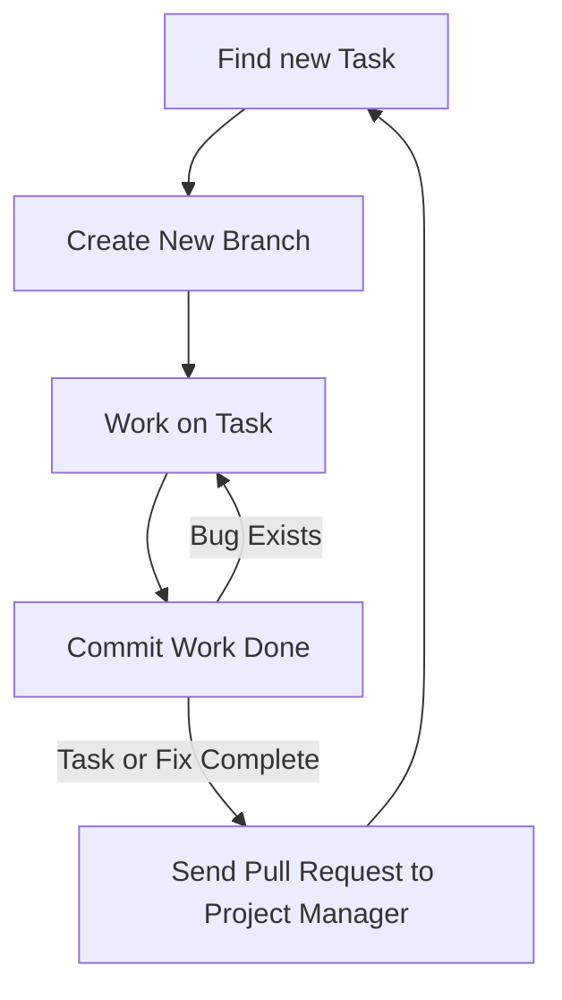

---
# Page title
title: Development Collaboration

# Title for the menu link if you wish to use a shorter link title, otherwise remove this option.
linktitle: Collaboration

# Date page published
date: 2021-03-23

# Academic page type (do not modify).
type: book

# Position of this page in the menu. Remove this option to sort alphabetically.
weight: 3

draft: False

---

العمل بشكل فعال كفريق هي احدى الجوانب الاكثر صعوبة في تطوير البرامج.
تكون هذه المشكلة اكبر بالنسبة للمبرمجين عديمي الخبرة لأن طريقة نظام النص التشفيري للبرنامج ستؤثر على مدى تعامل اعضاء الفريق مع بعضهم البعض.
لحسن حظنا، نحن نستخدم "جانقو"، لقد تم تنظيم طريقة عمل نظام الشفرة مسبقاً، مشاريع "جانقو" منظمة لكي نستغل ال “OOP” و نتمكن من العمل كفريق بشكل فعال. 

ويبقى السؤال: كيف لأعضاء الفريق أن يتعاملوا مع بعضهم و يجمعوا النص التشفيري الى نص موحد. 

هناك طريقتين للتعاون أو للعمل كفريق:

# 1- التعاون المتزامن 

في التعاون المتزامن عبر الانترنت، أعضاء الفريق المتعاون يقومون بالعمل على نفس الملف في نفس الوقت مع بعضهم البعض،
تسهل هذه العملية خلال موقع “repl.it” و تتطلب فقط إرسال رابط الملف الى اعضاء الفريق، موقع “repl.it” يقوم بعمل فعال في التعاون المتزامن حيث أنه يسمح لأعضاء المجموعة أن يعملوا على ملف واحد في آن واحد وأن يتواصلوا مع بعضهم خلال العمل.

مع ذلك، هذا النوع من المشاركة محدود:
١. يتطلب جدول منسق
٢. عدد المشاركين محدود، من المنطقي أن يعمل فردان في وقت واحد 
٣. مساهمة الأفراد غير متابعة 
٤. ممكن أن تتطلب خبرة فرد من الأفراد لتتم عملية المشاركة بنجاح

الفائدة الأساسية للمشاركة المتزامنة عبر الانترنت هي مشاركة العلم. 
يعمل المساهمين على حل المشاكل و في النهاية يستفيد الفرد الأقل خبرة بشكل كبير من أعضاء الفريق الآخرين، التعاون المتزامن مشابه ل”eXprogramming” نوعا ما.

## كيفية استخدام التعاون المتزامن على موقع Replit.com؟

هناك طريقتان رئيسيتان:

1. قم بإنشاء فريق 
repl كجزء من
[فريق MISCBA على replit.com]
 يسمى **repl متعدد اللاعبين**
(https://replit.com/team/miscba)



ثم شارك عنوان ال url من المتصفح:



2. بدلا من ذلك، يمكنك إنشاء 
repl 
عادي مع إضافة متعاونين باستخدام زر المشاركة:



# 2- تعاون غير متزامن

في التعاون الغير متزامن، أفراد المجموعة بإمكانهم العمل على المشروع في وقتهم الخاص ولا حاجة للتفاعل مباشرة مع اعضاء المجموعة،
بدلاً من ذلك، يتم استخدام نظام لإدارة كيفية قيام كل عضو بتغيير نص المشروع ولتمكين دمج العمل من أعضاء متعددين في نص واحد، هذه هي الطريقة الأكثر فعالية والأكثر استخداماً للتعاون في البرمجة، النظام الأكثر شيوعاً في الوقت الحالي لأدارة العمل المتزامن هو “git” الذي يوفره موقع “github”.

سيتطلب استخدام git أو github من المطورين تعلم أداة جديدة قد لا يكون من السهل تعلمها في البداية. ولكن بمجرد استخدام المطورين للأداة بشكل صحيح ، من الممكن تمكين تعاون آلاف المطورين في مشروع واحد ، كما يمكن رؤيته في [مشروع لينوكس كيرنال]
(https://github.com/torvalds/linux).

لحسن الحظ، يتكامل موقع 
replit.com 
جيداً مع 
github، 
سنستخدم ميزات 
git
الرئيسية من داخل 
replit.com،
وبالنسبة للمهام الأخرىمثل دمج وحل المشاكل والتعارضات،
سنستخدم واجهة الويب التي يوفرها
github.com
لأداء هذه المهام المتعلقة بالتعاون.

استخدام github
لا يكفي للتعاون بشكل فعال، لكي تكون فعالة يجب استيفاء الشروط التالية: 
1. تم تنظيم الكود لتمكين التعاون (يفرض Django ذلك على المشروع بالطريقة التي ينظم بها الكود)
2. يجب أن يتفق الفريق على سير عمل يصف كيف سيبدأ كل عضو العمل ، وما يجب العمل عليه ، وكيفية مشاركته عند الانتهاء.
3. يجب على جميع أعضاء الفريق الالتزام بسير العمل عند الترميز  للمشروع.
## سير العمل

سيكون لكل فريق مسار عمل خاص به ، ولذا فإننا نوصي بمسار عمل لتستخدمه في هذه الدورة التدريبية. سير العمل كما يلي:

** يمكن أن تكون المهمة ** إنشاء ميزة جديدة أو إصلاح خطأ موجود. يصف مسار العمل الطريقة التي يجب أن يتصرف بها المطورون عند العمل في مهمة. الخطوات الرئيسية هي:

{}
 لمعرفة الخطوات التي نفذت على GitHub
 معرفة الخطوات التي نفذت على Replit.com
{}

1.  **البحث عن مهمة أو إصلاح للعمل عليها:** تقع على عاتق مدير المشروع مسؤولية التأكد من أن المطورين يمكنهم العثور على مهام للعمل عليها. يمكن العثور على هذه المشكلات مدرجة في مشكلات GitHub ، أو نظام التذاكر المستخدم للمشروع ، أو التحدث إلى مدير المشروع ، أو قراءة مستند المتطلبات. لهذه الدورة، يجب على مديري المشاريع كتابة المهام كمشكلات في GitHub. يمكن للمطورين أيضا المساعدة عن طريق كتابة المشكلات التي يمكن إما أن تكون اقتراحات ميزة bew أو أوصاف الأخطاء التي تحتاج إلى إصلاح. سنناقش إدارة المشروع بمزيد من التفصيل في [القسم التالي]().
2.  **استيراد مشروعك من GitHub** كما هو موضح في الشكل. كما أنه من الجيد استيراد نفس المشروع مرة أخرى في كل مرة تريد فيها بدء عمل جديد لضمان حصولك على نسخة جديدة من التعليمات البرمجية.

   -**هام: سحب التحديثات للمشاريع الموجودة:** إذا كنت لا تريد استيراد المشروع مرة أخرى وتفقد عملك على replit، تأكد من **pull** التحديثات التي تم دمجها إلى الفرع الرئيسي من قبل مدير المشروع على GitHub. سيضمن لك ذلك بدء عملك باستخدام أحدث إصدار من التعليمات البرمجية

3.  **إنشاء فرع جديد:** الفروع تسمح للمطور لتغيير التعليمات البرمجية دون خوف من تخريب المشروع. عند البدء في مهمة برمجة، قم دائما بإنشاء فرع git جديد للمهمة من الفرع الرئيسي. فرع يسمح لك بتغيير التعليمات البرمجية لك فقط، وليس التأثير على عمل الآخرين. يجب أن تتذكر دائما ما يلي:
   - **لا تعمل أبدا مباشرة على الفرع الرئيسي**. 
   - **إنشاء فرع جديد** من الفرع الرئيسي فقط.
   - الفرع الرئيسي **وينبغي دائما** لديك نسخة عمل من المشروع، أبدا واحدة مكسورة.
   - **اختيار اسم** للفرع الجديد الذي يعكس ما يتم القيام به. على سبيل المثال bug_1234، حيث الرقم هو رقم المشكلة على github. أو feature_1234 لمعرفة الأحرف المسموح بها في اسم الفرع [يرجى قراءة هذه المقالة](https://git-scm.com/docs/git-check-ref-format).



4.  **العمل على المهمة**: تأكد من أن المهمة التي تعمل عليها صغيرة وبسيطة. إذا كانت هناك مهام كبيرة ومعقدة، فقسمها إلى مهام أصغر.
5.  **تنفيذ المهمة**: عند الانتهاء من المهمة، أو الوصول إلى معلم في عملك، يجب عليك الالتزام بالعمل. هذا من شأنه أن يسمح لك لخلق لقطة من العمل الذي قمت به ليتم تخزينها في التاريخ github. ميزة وجود لقطة الالتزام هو أنه يمكنك العودة إلى هذا الإصدار من التعليمات البرمجية في أي وقت. لذلك، فمن المستحسن الالتزام بشكل متكرر وحتى للتغييرات الصغيرة. فقط تأكد عند الالتزام أن تكتب رسالة مفيدة للتاريخ لمعرفة ما فعلته في هذا الالتزام. يجب دوما الالتزام واختبار العمل الخاص بك ومتابعة تغيير التعليمات البرمجية والالتزام حتى تتأكد من أن التغييرات التي قمت بها مقبولة واكتمال المهمة.
   
6.  **إرسال طلب سحب**: إذا كنت متأكدا من اكتمال المهمة ثم استخدام github لإرسال طلب سحب. طلب السحب بإيجاز مدير المشروع أن العمل على هذا الفرع كاملة وجاهزة لإضافتها إلى الفرع الرئيسي. تقع على عاتق مدير المشروع مسؤولية الاستجابة لطلب السحب ودمجه في الفرع الرئيسي. يمكن أن يكون طلب السحب دمج فرعين من نفس المستودع ، كما سنفعل في الغالب في هذه الدورة. هذا هو الحال بالنسبة لأعضاء الفريق الذين يعملون على نفس الريبو: 



كما يمكن استخدامه لطلب دمج الفروع بين المستودعات المتفرعة والسماح لك بإرسال عملك إلى مشروع لست عضوا فيه:


بمجرد إنشاء طلب سحب يمكن لمدير المشروع وأعضاء الفريق مناقشة طلب السحب هذا ومعرفة ما يتم القيام به حتى الآن من قبل مدير المشروع فيما يتعلق بهذه المسألة.



يتوقع من الجميع اتباع هذه الخطوات كلما كنت تعمل على مشاريع التنمية في هذه الدورة. قد يبدو وكأنه النفقات العامة في البداية، وسوف لا ترى الفوائد على الفور. ومع ذلك، فإن الهدف هو الحصول على كيفية ممارسة التعليمات البرمجية كجزء من فريق. لذلك عند بدء تشغيل المشروع النهائي الخاص بك، سوف تبدأ في رؤية فوائد سير العمل هذا.

## Git and GitHub

اعلم أن الأداة التي نستخدمها للتعاون غير المتزامن تعرف باسم **Git**. يسمح للمطورين بتتبع جميع التغييرات التي تم إجراؤها على مشاريعهم. يمكن استخدامه على الكمبيوتر المطور باستخدام سطر الأوامر أو تطبيق سطح المكتب GitHub. يمكنك استخدامه بدون GitHub.

GitHub هي منصة سحابة استضافة خدمات Git. لها منصة وسائل الاعلام الاجتماعية للمطورين بنيت حول تطبيق جيت. نظرا لأن Git مفيد جدا للمطورين ، يتم استضافته على منصتهم لاستخدام الجميع مجانا ، شريطة أن يجعلوا مستودعاتهم عامة. يمكنك دفع اشتراك إذا كنت ترغب في الحصول على مستودعات خاصة. وعلاوة على ذلك، قام GitHub ببناء مجموعة من أدوات إدارة المشاريع وأدوات الترميز الاجتماعي حول Git. القضايا والفصول الدراسية والمشاريع وطلبات السحب وملفات تعريف المطور ليست جزءا من Git ، ولكن تمت إضافتها خصيصا ل GitHub وجعل الترميز أكثر اجتماعية. وسوف نستخدم العديد من هذه الميزات لتحسين التعاون ولأغراض إدارة المشاريع.

هناك العديد من المصطلحات التي تحتاج إلى أن تكون على علم لاستخدام Git و GitHub بشكل فعال. ونلخصها في الجدول التالي. يحدد المجال ما إذا كان هذا المصطلح خاصا بتطبيق Git أو تم تقديمه كجزء من الميزات الاجتماعية الإضافية التي بناها GitHub:

### Git and GitHub Terminology

| **Term** | **Domain** | **Meaning** |
| --- | --- | --- |
| **Repo/Repository** | Git | المستودع هو المكان الذي توجد فيه التعليمات البرمجية المصدر وتاريخ جميع الإجراءات والتغييرات التي تم إجراؤها عليها. repo محلي موجود على الكمبيوتر المطور&#39 s وهو مطلوب للمطور للقيام بالعمل. الريبو البعيد هو واحد موجود على جهاز آخر. يتم استضافة إعادة تشغيل GitHub على GitHub لجعلها في متناول المطورين الآخرين وتعتبر repo بعيدة لجميع المطورين. |
| **Clone** | Git | إنشاء نسخة محلية من repo. يمكن أن يكون repo المنسوخ إما عن بعد أو محليا |
| **Fork** | GitHub | على غرار استنساخ لكنه يحدث على خوادم GitHub. يتم إنشاء ريبو GitHub ك نسخة من ريبو GitHub آخر. وسيكون للإعادة الجديدة حيز مشروع خاص بها، بما في ذلك القضايا والويكي والمناقشات. |
| **Commit** | Git | في CVCS ، الالتزام هو فعل نشر التغييرات ، التي أجريت محليا ، إلى الريبو المركزي. بالنسبة ل Git ، يعد هذا الأمر بمثابة تعليمات ل Git لأخذ لقطة من قاعدة التعليمات البرمجية في حالته الحالية. تتم الإشارة إلى اللقطة كمراجعة. الالتزام بقاعدة التعليمات البرمجية من شأنه إنشاء المراجعة محليا. لنقل المراجعة إلى مستودع آخر، يجب على المطور المحلي دفعها، أو يجب على مطور خارجي سحبها. |
| **Rev/Revision** | Git | لقطة من قاعدة التعليمات البرمجية التي اتخذتها الأمر الالتزام. يتم تمثيل المراجعة بواسطة سلسلة SHA1 فريدة من نوعها إلى تلك المراجعة. يمكن للمطور التبديل إلى أي حالة سابقة من قاعدة التعليمات البرمجية، سواء ككل أو كملف واحد، عن طريق الإشارة إلى رقم المراجعة. |
| **Checkout** | Git | إجراء لإعادة قاعدة التعليمات البرمجية أو ملف أو مجموعة من الملفات إلى مراجعة معينة |
| **Branch** | Git | إنشاء نسخة مسماة من التعليمات البرمجية المصدر المستضافة في الريبو الذي يسمح للمطور بتجربة وإجراء تغييرات على التعليمات البرمجية المصدر والالتزام بها لإنشاء مراجعات جديدة. يمكن للمطور حذف الفرع إذا لم يكن راضيا عن العمل وتجاهل كافة المراجعات التي تمت في الفرع، أو يمكن للمطور دمج الفرع إلى الفرع الرئيسي، مما يجعل المراجعات الجديدة جزءا من الشريحة الرئيسية. |
| **Master branch** | Git | الفرع الرئيسي المستخدم لاستضافة كافة التعليمات البرمجية التي تم قبولها (النسخة الرئيسية). لا يعمل المطورون عادة مباشرة على الفرع الرئيسي ولكنهم يقومون بإنشاء فروع بديلة للعمل عليها، ثم دمج تغييرات التعليمات البرمجية المقبولة إليها. كلما يحتاج المطورون إلى البدء بنسخة جديدة من قاعدة التعليمات البرمجية ، فإنهم عادة ما يتفرعون من الرئيسي. |
| **Merge** | Git | يعرف دمج المراجعات من فرعين مختلفين بالدمج. يتم تنفيذها تلقائيا على سحب أو دفع الفروع. يمكن أن يحدث الدمج بشكل متجانس وتلقائي إذا لم يكن للمراجعات تعارض. يعرف هذا بالدمج السريع. إذا كانت المراجعات المدمجة متعارضة، فيجب على المطور حل التعارض في كافة الملفات يدويا، ثم إجراء الدمج بشكل صريح. |
| **Conflict** | Git | يحدث تعارض عند تغيير اثنين من المراجعات نفس السطر ولا يمكن دمج هذه التغييرات. سوف Git تسليط الضوء على هذه السطور للمطور وتشمل كلا الخطين من كل مراجعة بحيث يمكن للمطور عرضها جنبا إلى جنب والجمع بينهما يدويا. بمجرد حل كافة الملفات التي بها مثل هذه التعارضات وحفظها، يجب على المطور إصدار أمر دمج يدويا ل Git لقبول حل التعارض. |
| **Push** | Git | إجراء يسمح للمطور بسحب المراجعات من فرع آخر إلى الفرع الذي يعمل عليه المطور حاليا. يتم نقل المراجعات الفريدة للفرع الذي يتم سحبه منه فقط إلى فرع العمل. الفروع لا يجب أن تكون على نفس الريبو. يمكن للمطور سحب فرع من الريبو البعيد. لا يمكن إجراء دفعة إذا كان هناك تعارض بين فرع العمل والفرع البعيد. يجب على المطور سحب الفرع البعيد أولا، حل أي تعارض، ثم دفع المراجعات المدمجة. |
| **Pull** | Git | إجراء يسمح للمطور بإرسال مراجعات إلى فرع من الفرع الذي يعمل عليه المطور حاليا. يتم إرسال المراجعات الفريدة لفرع العمل فقط إلى الفرع الآخر. يمكن أن يكون الفرع الذي يتم دفعه إلى repo المحلي أو الريبو البعيد. |
| **Pull Request** | GitHub | عمل شعبية من قبل GitHub. لسحب من فرع بعيد، المطور يحتاج إلى معرفة عنوان الجهاز البعيد. قام GitHub بتبسيط هذه العملية من خلال السماح للمطور بمراجعات جديدة بإرسال طلب من الريبو إلى repo آخر على GitHub. وستشمل الريبو معلومات عن العنوان والفرع لسحب من. يمكن للمطور الذي يتلقى طلب السحب عرض التغييرات، والتحدث عنها، وقبولها أو رفضها. إذا تم قبولها، يتم دمج التغييرات إلى repo تم إرسال طلب السحب إليه. |
| **Upstream** | Git | سلسلة المستودعات البعيدة التي استنسخ منها الريبو الحالي. يتطلب دفع التعليمات البرمجية إلى المنبع بذل جهد، حيث يجب القضاء على التعارض. عادة ما يتم إرسال طلبات السحب لإعادة الشراء في المنبع. |
| **Downstream** | Git | شبكة من جميع repos التي تم استنساخها من الريبو الحالي. رمز تتدفق إلى أسفل جهد، كما يتم تفويض مسؤولية حل الصراع للمطورين في المصب عندما سحب من الريبو الحالي.
