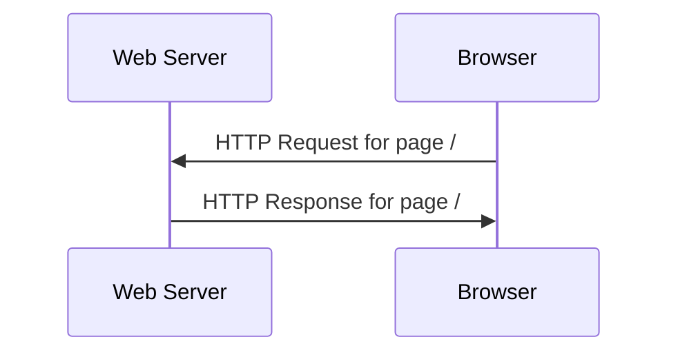
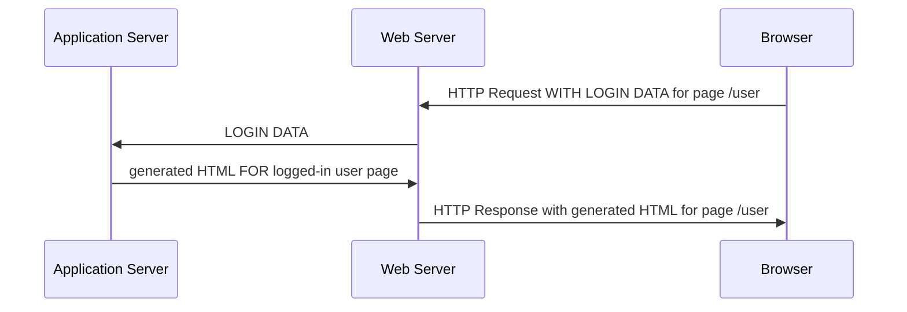
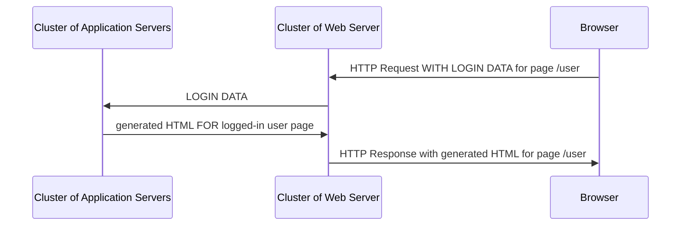
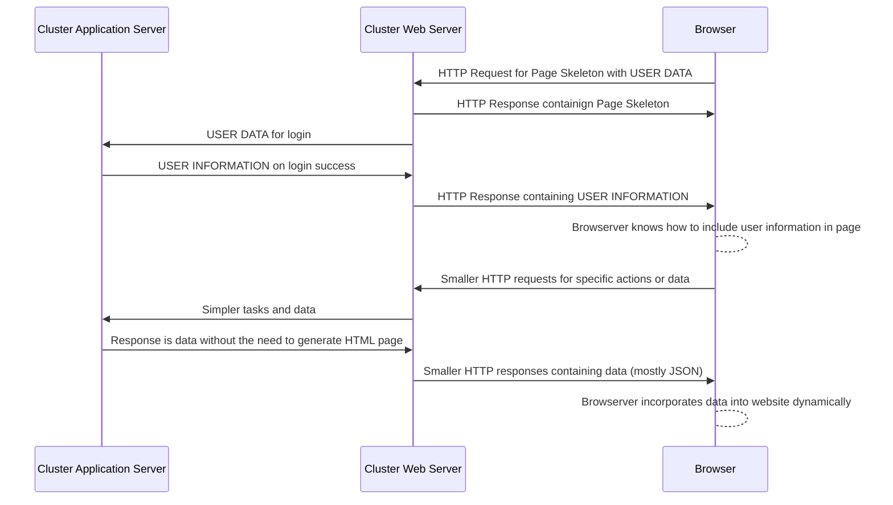

---
# Page title
title: Web Applications

# Title for the menu link if you wish to use a shorter link title, otherwise remove this option.
linktitle: Web Applications

# Date page published
date: 2021-03-23

# Academic page type (do not modify).
type: book

# Position of this page in the menu. Remove this option to sort alphabetically.
weight: 5

draft: False


---

تطبيقات ويب هي التطبيقات التي تعمل في مستعرض ويب. تطبيقات ويب قد استبدال تطبيقات سطح المكتب بسبب الفوائد التالية:

1. **Interoperability**: حيث أن المتصفحات متوفرة على جميع أنواع أجهزة الكمبيوتر والهواتف في العصر الحالي بغض النظر عن المواصفات أو نظام التشغيل المستخدم. لذلك ، يمكن استخدامها من قبل عدد أكبر من العملاء المحتملين.
2. **Manageability**: تم تطوير الكود مرة واحدة والاحتفاظ بها على خادم ويب مركزي. لتحديث التطبيق أو إصلاح الخلل ، يجب على مالك التطبيق تحديث التطبيق فقط على الخادم الخاص به وسوف يستفيد جميع العملاء من التحديث. على عكس تطبيقات سطح المكتب حيث يُطلب من العملاء تنزيل إصدارات أحدث من التطبيق. في تطبيقات الويب ، يتم التحديث بشفافية.
3. **Relative Security**: على الرغم من أن الأمان يمثل تحديًا دائمًا ، فإن حقيقة أن التطبيق يُدار في موقع مركزي يعني أن المالك يتمتع بقدر أكبر من التحكم فيما يتعلق بمراقبة التطبيق وإدارته وتحديثه. جعل الأمان ** أسهل نسبيًا ** مقارنة بتطبيقات سطح المكتب القائمة على الخادم. 
4. **Rapid Improvement in tools and Capabilities**: نظرًا لمستوى الابتكار الذي يحدث في أدوات تطوير تطبيقات الويب والبنية التحتية ، هناك نوع معين من التطبيقات أو المهام التي لا يمكن تنفيذها إلا عند استخدام تطبيق ويب حيث يمكن أن تنمو البنية التحتية لتطبيقات الويب لاستيعاب عدد أكبر من المستخدمين والقدرات. على سبيل المثال ، نشأ عصر البيانات الضخمة بسبب ظهور تطبيقات الويب على نطاقات تخدم العملاء العالميين. 
   
ومع ذلك ، تأتي تطبيقات الويب مع مجموعة التحديات الخاصة بها:
1. **Complexity of Infrastructure**:لم يعد تطوير التطبيقات مجرد مسألة بناء البرنامج. يتضمن بناء تطبيقات الويب الآن بناء البنية التحتية ، وبناء البرامج ، وإدارة نشر التطبيق وتشغيله بما في ذلك التعامل مع أي مشكلات تتعلق بالتوسيع قد تنجم عن زيادة عدد المستخدمين. كل هذه مشكلات لم يتم أخذها في الاعتبار عند إنشاء تطبيقات سطح المكتب التقليدية.
2. **Security and Privacy**: بيانات المستخدم والأمان هي الآن مسؤولية مالك تطبيق الويب. نظرًا لأن التطبيق سيتطلب اتصالاً بالإنترنت ، فإن هذا من شأنه أن يؤدي إلى طبقة إضافية من المخاطر التي يحتاج المالك إلى مراعاتها وإدارتها.
3. **Requires an Internet Connection**: سواء أكان تطبيقًا بسيطًا أو تطبيق شبكة معقدًا ، فستتطلب تطبيقات الويب دائمًا من المستخدم أن يكون لديه اتصال بالإنترنت. هذه بالتأكيد ليست مشكلة كبيرة في هذا العصر ، ومع ذلك ، فهذا يعني أنه لا يمكن استخدام تطبيق الويب في المواقف التي لا يتوفر فيها الإنترنت.
4. **Rapid Improvement in tools and Capabilities: هذا هو في الواقع منفعة والتزام. تخضع الأدوات المستخدمة لبناء تطبيقات الويب لتحسين سريع مع ظهور تقنيات جديدة كل يوم. في حين أن هذا يعني أن تطبيقات الويب ستتمتع بإمكانيات جديدة ، فهذا يعني أيضًا أن مالك تطبيق الويب يحتاج إلى التحسين والتعلم بسرعة حيث يمكن بسهولة حذف معرفته التنموية الحالية في غضون فترة زمنية قصيرة.

## Web Application History

تطورت تطبيقات الويب على مر السنين لتأخذ أشكالًا مختلفة. هذا التاريخ المختصر وسيوضح الفرق بين صفحة الويب و تطبيق الويب.

### Web Page

في الأيام الأولى من الإنترنت وعندما تم اختراع متصفحات الويب ، كان لدينا صفحات الويب. تحتوي صفحات ويب على محتوى ثابت (لا يتغير مع تغير المستخدم). وكان الابتكار الرئيسي هو النص المفرط، الذي سمح بربط الوثائق ذات الصلة. في هذه الأيام، لم يتم تسويق الإنترنت واستخدمت مواقع الويب لdissimenate المعلومات. تم إنتاج المحتوى باستخدام مالكي مواقع الويب. ولكن البروتوكولات الرئيسية المستخدمة لنقل معلومات صفحة الويب (HTTP) وعرض صفحة الويب (HTML) تم تطويرها خلال هذه الحقبة. سوف ترسل المتصفحات طلب HTTP لفتح صفحة ، وسيستجيب خادم الويب باستجابة HTTP تحتوي على HTML والصور اللازمة لبناء الصفحة على المتصفح. تم دفع المعلومات فقط من خوادم الويب إلى متصفح الويب ، لم يكن هناك تبادل للمعلومات.



### Early Web Applications

ثم أضاف HTTP إجراءات أخرى إلى البروتوكول والآن يمكن للمستعرضات إرسال الملفات والمعلومات إلى خادم الويب باستخدام إجراءات POST و PUT. كما حصلت HTML على علامة FORM التي تسمح للمستخدم بإدخال البيانات لإرسالها إلى الويب. لا يزال HTTP يستند إلى دورة الطلب والاستجابة ، ولكن الآن الاتصال في كلا الاتجاهين. مهد الابتكار الطريق لإجراء المعاملات باستخدام متصفحات الويب وبدأ تسويق الإنترنت جنبا إلى جنب مع مواقع التجارة الإلكترونية. الآن يمكن لمواقع الويب إعادة توجيه المعلومات الواردة من المتصفحات إلى خوادم التطبيقات التي تولد صفحات HTML على الطاير ، مع مواقع الويب التي لا تزال تقدم ملفات ثابتة مثل الصور إلى المتصفحات. يسمح هذا للصفحات الديناميكية حيث كل مستخدم سوف ترى معلومات مختلفة على نفس URL. صفحات الويب الديناميكية هذه هي ما يعرف الآن باسم تطبيقات الويب. تم إنشاء المحتوى في هذه الحقبة في الغالب من قبل مالكي مواقع الويب.


### Web 2.0 Applications

كل ما تغير في عصر Web2.0 هو أن تطبيقات الويب تم استغلالها لإشراك المستخدم في إنشاء المحتوى لتطبيقات الويب. ويكيبيديا، تويتر، الفيسبوك .. الخ. لم يكن لكل هذه الأنظمة الأساسية محتوى ولكنها اعتمدت على شبكة المستخدمين لتوليد المحتوى والقيمة. تطبيق الويب على الرغم من كان لا يزال هو نفسه باستخدام خادم التطبيقات التي أدت الإجراءات وخادم الويب تخدم الملفات الثابتة فقط. ومع ذلك ، فإن المقياس الآن أكبر بكثير والبنية التحتية ليست أكثر تعقيدا بكثير لتكون قادرة على التعامل مع الزيادة في عدد المستخدمين والمحتوى الذي يسافر في كلا الاتجاهين. سيكون لتطبيق الويب مثل Facebook مجموعة من خادم الويب وآخر لخوادم التطبيقات ، وثالث لقواعد البيانات التي تعمل جميعا معا لتكون بمثابة البنية التحتية لمنصة Facebook. مع هذه الزيادة في عدد المستخدمين ، ظهرت الآن الحاجة إلى جعل المواقع أكثر استجابة وأقل تطلبا ، والتي كانت هي التجريبية للمرحلة التالية في تطور تطبيقات الويب.




### HTML5 Web Applications (Dynamic, Frontend Applications)

أكبر تغيير في هذا العصر من صفحات الويب الديناميكية هو فكرة أنه لا يجب إعادة بناء الصفحة بالكامل بعد إرسال كل طلب إلى الويب. لماذا لا تخدم هيكل عظمي الصفحة عندما المستخدم فتح تطبيق ويب لأول مرة، ثم الطلبات اللاحقة إلى الخادم يمكن أن يكون لبت صغيرة من المعلومات التي المتصفح سوف تعرف كيفية تضمينها في الصفحة. وهذا هو السبب في جافا سكريبت تم تضمينها في المتصفحات خصيصا للسماح للمطورين لتنفيذ صفحات HTML التي يمكن أن تتغير بشكل حيوي. الصفحة لا تزال ثابتة HTML و CSS، ولكن جافا سكريبت يسمح لها بتغيير. تطورت هذه التقنيات إلى ما يعرف اليوم باسم تطبيقات الويب HTML5. ينصب تركيز هذه الحقبة على تجربة المستخدم. TNow المتصفح وwebserver تعاونت لتقديم المستخدم مع تحسين تجربة تطبيق الويب التي شعرت مثل applciations سطح المكتب. تم تقسيم تطوير الويب الآن إلى تطوير واجهة أمامية للمصممين الذين يركزون على المتصفح ، وتطوير الخلفية للمهندسين الذين يركزون على البنية التحتية والبيانات.



### The Web Application Infrastructure

|   |  Web Page | Web Applcation  |  Web 2.0 Application | HTML5 Application  |
|---|---|---|---|---|
| Browser  | Standard HTML browsers | Standard HTML Browsers  | Standard HTML browser  | Modern Browsers with HTML5 capabilities  |
| Web Server  | Serves HTML, images, and files  | Serves HTML, images, and files.</br>Forwards data to application server | Serves HTML, images, and files.</br>Forwards data to application server  | Serves HTML, images, and files.</br>Forwards data to application server | Serves HTML, images, and files.</br>Forwards data to application server</br>Cloud hosted components becoming more prominent |
| Application Server | N/A  | Needed for Business Logic  | Needed for Business Logic  | Optional, since logic can be implemented in the browser now |
| Content | Static | Dynamic  | Dynamic  | Dynamic  |
| Page Rendering | New page with every Request/Response Cycle  | New page with every Request/Response Cycle | New page with every Request/Response Cycle | Part of the page updated only  |
| Request/Response Cycle | Fetching files and static HTML only | Data exchange and page rendering   |  Data exchange and page rendering |  Data exchange and page rendering |


### The Infrastructure in the Cloud Era

في حين أن مكونات البنية التحتية هي نفسها ، فإن أكبر تغيير في عصر السحابة هو أن العديد من مكونات البنية التحتية تعتمد الآن على السحابة. وهذا يعني أن بعضها قد يكون خدمات SaaS التي تقدمها الشركات التي تركز على عنصر محدد من البنية التحتية. على سبيل المثال ، قد يكون تطبيق الويب قاعدة بياناته التي تديرها الأمازون ، خادم الويب من قبل المحيط الرقمي ، CDN بواسطة cloudflare. ويمكن إضافة خدمات أخرى إلى البنية التحتية مثل قاعدة البيانات الأصالة أو الجغرافية المكانية التي يديرها مزودون آخرون. مالك تطبيق الويب يدير **mashup*** من هذه الخدمات وحزم لهم في تطبيق قابل للاستخدام.

### The Application Server

خادم التطبيق هو ملقم يقبل الطلبات التي تم إعادة توجيهها من خادم الويب وهو قادر على إنشاء استجابة HTTP مناسبة. يستخدم خادم التطبيق لغات البرمجة لمعالجة الطلبات ويمكنه إنشاء نص HTML فريد على الطاير. نوع البرامج المكتوبة لخادم applciation عادة ما تتضمن كتابة الدالات التي تأخذ طلبات HTTP كمدخلات وتوليد استجابات HTTP التي تحتوي على HTML أو أشكال أخرى من المحتوى في نص الاستجابة. اللغات المستخدمة لبناء خوادم applciation تشمل جافا، بيثون، C # ، روبي، سكالا، الذهاب، جافا سكريبت، والعديد من اللغات الأخرى. هو المنطق الكتابة في هذه الملقمات التي تعتبر منطق تطبيق الويب. وستكون هذه الخوادم مسؤولة عن إدارة التوثيق وإدارة العربات وإدارة المعاملات. لم يتم تصميم خادم التطبيق لمعالجة ملفات وصور ثابتة، وقد يتضمن هذه الميزات لأغراض الاختبار فقط. ونتيجة لذلك، عند إنشاء تطبيق ويب، يحتاج خادم تطبيق اختبار إلى التشغيل قبل أن تتمكن من رؤية النتائج على المستعرض. إذا لم يكن الملقم قيد التشغيل، لا يمكنك اختبار التطبيق الذي تم إنشاؤه.

### The Request Response Cycle

خدمة صفحة HTML أو تطبيق ويب يبدأ دائما مع المتصفح. يجب على المستخدم كتابة URL الصحيح. يبدو عنوان URL كالتالي:

    http://www.twitter.com/signup

**http://** هو جزء البروتوكول. كيف يخبر المستخدم المستعرض البروتوكول الذي لاستخدامه للاتصال مع الملقم. البروتوكولات الشائعة الأخرى التي يمكن استخدام المستعرضات هي **https://** للاتصال الآمن مع خادم الويب و **ftp://** للاتصال مع ملقمات الملفات.

**www.twitter.com** هو جزء اسم المضيف. ال **twitter.com** يعرف جزء من اسم المضيف باسم المجال. اسم المضيف هو اسم مستعار لعنوان IP الخاص بالخادم. فإنه يحصل على ترجمتها من قبل خدمات DNS إلى عنوان IP الذي يستخدم المتصفح لتحديد أي خادم على شبكة الإنترنت للاتصال مع.

**/signup** يعرف باسم المسار. هذا يحدد ما الملف أو الخدمة نود تطبيق ويب أو خادم لتوفير. ال **/** يعرف باسم المسار الجذر. عادة ما يوفر المستعرض مع الصفحة الرئيسية التي سوف نرى المستخدم عند زيارة موقع على شبكة الانترنت. ثم، كل وظيفة، ملف، صورة، أو خدمة على موقع الويب أو تطبيق الويب سيكون لها مسار فريد خاص بها. عند بناء تطبيقات الويب ، يجب أن تكون مرتبطة servies مع مسار فريد ، وإلا فإن المستخدمين لن يكون الوصول إلى الخدمة.

بعد كتابة عنوان URL في المستعرض، سيحاول المتصفح أولا العثور على عنوان IP الخاص بخدمة الويب استنادا إلى اسم المضيف المقدم من خلال التواصل مع خدمات DNS. بمجرد الحصول على IP، سيبدأ المستعرض الاتصال باستخدام البروتوكول المطلوب، عادة، سيكون هذا HTTP.

يتم بدء الاتصال دائما من قبل المتصفحات، والمعروف أيضا باسم العملاء. تعتبر تطبيقات الويب شكلا من أشكال تطبيق العميل/الخادم مع المستعرض كونه العميل وخادم الويب هو الخادم. عند تأسيس الاتصال، يرسل المستعرض طلب يستند إلى نص، يعرف باسم طلب HTTP، يحتوي على المعلومات المطلوبة من قبل الملقم لتوفير الخدمة المطلوبة. يبدو طلب HTTP شيء مثل هذا:

```
GET /hello.htm HTTP/1.1
User-Agent: Mozilla/4.0 (compatible; MSIE5.01; Windows NT)
Host: www.tutorialspoint.com
Accept-Language: en-us
Accept-Encoding: gzip, deflate
Connection: Keep-Alive
```

هنا العميل هو قول الخادم الذي يريد **GET** الملف **/hello.html** باستخدام بروتوكول الاتصالات **HTTP 1.1** . يعرف جزء المضيف اسم المضيف الذي يحاول العميل الاتصال به. كافة الأسطر الأخرى هي معلومات حول العميل بحيث يعرف الملقم كيفية توفير البيانات الصحيحة للعميل. يعرف هذا الطلب بطلب GET ويستخدم لتلقي الملفات والصور وصفحات HTML.

يستجيب الملقم باستجابة HTTP قياسية قد تبدو كما يلي:
```
HTTP/1.1 200 OK
Date: Mon, 27 Jul 2009 12:28:53 GMT
Server: Apache/2.2.14 (Win32)
Last-Modified: Wed, 22 Jul 2009 19:15:56 GMT
Content-Length: 88
Content-Type: text/html
Connection: Closed

<html>
<body>
<h1>Hello, World!</h1>
</body>
</html>
```

يوفر السطر الأول تأكيد أن الملقم بنجاح العثور على البيانات المطلوبة وسيتم تقديمه. توفر الخطوط التالية كافة المعلومات حول الاستجابة. وتتضمن الاستجابة أيضا نصا يحتوي على البيانات المطلوبة. يبدأ النص الأساسي من السطر الذي يحتوي على **<html>** ويذهب إلى نهاية الاستجابة. الجزء الأساسي من صفحة HTML التي سيتم عرضها للمستخدم.

طلبات POST تختلف قليلا عن طلبات GET في أنها عادة ما تتضمن أيضا نصا، حيث أن الهدف من طلب POST هو إرسال البيانات إلى الويب. يمكن أن يبدو طلب POST ما يلي:

```
POST /cgi-bin/process.cgi HTTP/1.1
User-Agent: Mozilla/4.0 (compatible; MSIE5.01; Windows NT)
Host: www.tutorialspoint.com
Content-Type: application/x-www-form-urlencoded
Content-Length: length
Accept-Language: en-us
Accept-Encoding: gzip, deflate
Connection: Keep-Alive

licenseID=string&content=string&/paramsXML=string
```

وهو مشابه جدا لطلب GET، إلا أنه يحتوي على النص الأساسي الذي هو الخط الذي يبدأ ب licenseID. يتضمن هذا السطر معلومات يتم ترميز URL التي سيتم تسليمها إلى الملقم. الأمثلة النموذجية لاستخدام طلبات POST هي إرسال مجموعات اسم المستخدم وكلمة المرور أو سياق تغريدة أو مشاركة مدونة. كل هذا يتوقف على التطبيق على شبكة الإنترنت وانها مسؤولية المطور لكتابة الوظيفة التي تستخرج البيانات من الطلب ويؤدي الإجراء المناسب معها، مثل تخزينه في قاعدة بيانات أو تقديم صفحة HTML.

هذا هو مقدمة بسيطة لبروتوكول HTTP ، للحصول على وصف أكثر تفصيلا للبروتوكول يرجى [قراءة هذا المنصب](https://developer.mozilla.org/en-US/docs/Web/HTTP/Messages). فهم كيفية عمل HTTP هو المفتاح لفهم مشاكل الأمان المرتبطة بتطبيقات الويب وفهم كيفية إدارة تطبيقات الويب وتوسيع نطاقها.

### The Protocols

- **HTTP:** بروتوكول محول النص الفائق. هذا بروتوكول نص واضح يستند إلى حيث يتصل العميل والخادم باستخدام نص قابل للقراءة.
- **HTTPS:** مشابهة HTTP، ولكن النص مشفر.
- **SSL/TLS:** اثنين من البروتوكولات الرئيسية المستخدمة لتشفير نص الاتصالات HTTPS. SSL لتقف على طبقة مأخذ التوصيل الآمنة وهو السلف ل TLS. الآن معظم المواقع استخدام TLS، والتي تقف على النقل طبقة الأمن. 
- **HTML:** لغة ترميز النص Hypter. وهي لغة تستخدم لإعطاء بنية مستند نصي وتستخدم أيضا لتغيير تنسيق النص، تماما مثل مستند الكلمة. تعتبر مستندات HTML قاعدة نصية وتبدو كما يلي:
```
 <!DOCTYPE html>
<html>
<body>

<h1>My First Heading</h1>
<p>My first paragraph.</p>

</body>
</html> 
```

يمكنك مشاهدة مستند HTML قابل للقراءة. إذا تم فتحه من قبل المتصفح سيبدو الأمر هكذا:


- **CSS:** أوراق الأنماط المتتالية. إنها الطريقة التي يمكن من خلالها التحكم في الأنماط والألوان والخطوط وكيف يبدو النص في صفحات HTML. أفضل الممارسات هي استخدام HTML لتصميم بنية الصفحة، ثم تعيين تنسيق الصفحة وألوانها باستخدام CSS.

لمزيد من التجربة والتعرف على HTML يمكنك استخدام هذا [HTML scratch pad](https://www.w3schools.com/html/tryit.asp?filename=tryhtml_basic_document) للتجربة مع كتابة HTML. استخدم هذا [HTML tutorial](https://www.w3schools.com/html/) to learn what tags you can use.


### Where Does Django Fit In?

Django هو بيثون على أساس إطار تطبيق الويب. يسمح للمستخدم بالتعامل بسهولة مع طلبات HTTP وإنتاج استجابات HTTP الصحيحة. ومع ذلك، بدلا من العمل مع النص HTTP، فإنه يخفي كل هذا من المطور ويسمح للمطور للعمل كما لو كانوا بناء أي تطبيق بيثون الأخرى القائمة. الإطار يضع بعض القيود على المطور ، على سبيل المثال ، فإنه يجبر المطور لتنظيم ملفات المشروع بطريقة معينة واستخدام ملفات محددة للوظائف التي تتعامل مع طلبات HTTP / استجابة cyles وغيرها من الملفات لإدارة قاعدة البيانات. ونتيجة لذلك ، عند الالتزام بنجاح بهذه القيود ، يحصل المطور على العديد من الخدمات والفوائد مجانا. على سبيل المثال، تحسين الأمن، والتشفير سهلة، واجهة المشرف لإدارة البيانات، ومسارات URL نظيفة، templating سهلة وغيرها الكثير.

في هذه الدورة سوف تلمس فقط على بعض من ملامح جانغو. يمكن أن يكون استخدام Django معقدا أو بسيطا كما يحتاج المطور. يمكن أن يكون وسيلة لبناء بسرعة نماذج تطبيق الويب أو مهندس حل معقد يمكن أن تخدم مواقع كبيرة مثل تويتر، الفيسبوك، أو سناب شات. تم بناء بعض الخدمات المعروفة على شبكة الإنترنت باستخدام بيثون، بما في ذلك:
- Instagram
- Uber
- Pintrest
- Dropbox
- Netflix
- Reddit
- and many more

ومع ذلك ، ضع في اعتبارك أنه مع نمو الموقع وتوظيف المزيد من المهندسين للعمل عليه ، يتم استخدام تقنيات أخرى لإدارة البنية التحتية. لذلك ، لا يمكننا القول إن هذه المواقع يتم بناؤها باستخدام Django أو Python فقط. لكنها evovled لتشمل غيرها من التكنولوجيات واللغات كل تخدم غرضا محددا. عادة ما يتم تنفيذ الأفكار في البداية مع تقنية واحدة ومع ذلك. وإذا تطورت لتشمل تكنولوجيات أخرى، فمن المرجح أن تكون علامة على نجاح الخدمة ونموها.