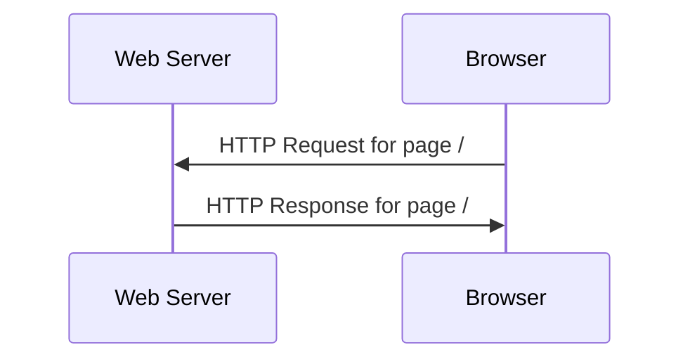
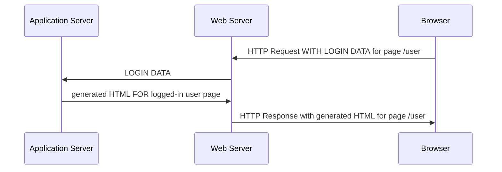
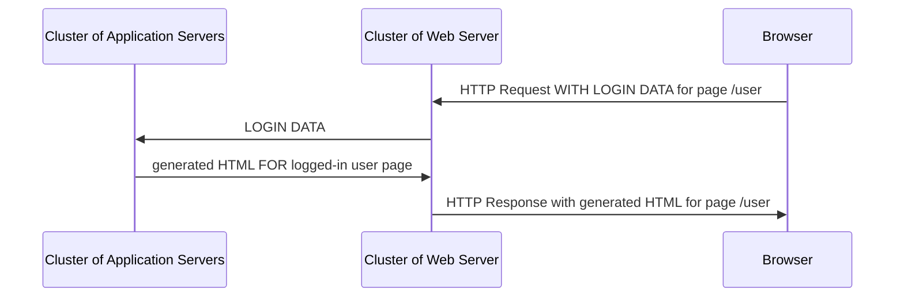
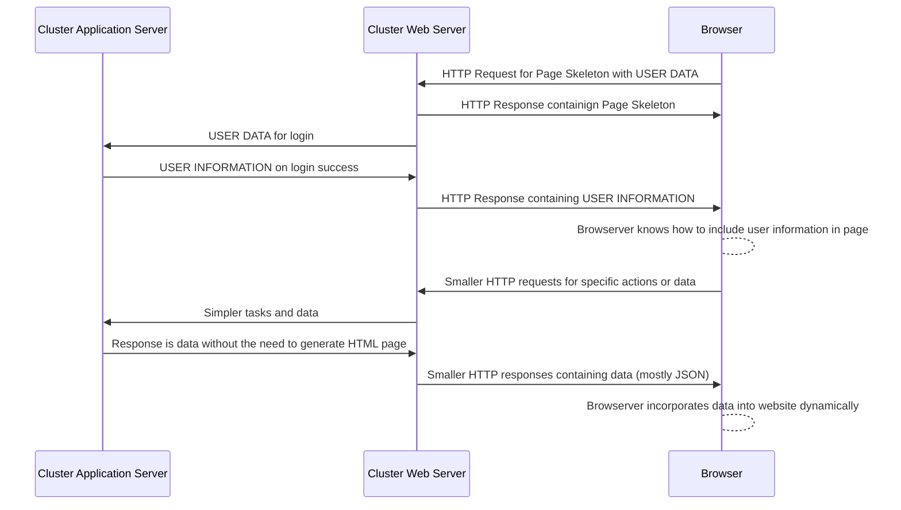

---
# Page title
title: Web Applications

# Title for the menu link if you wish to use a shorter link title, otherwise remove this option.
linktitle: Web Applications

# Date page published
date: 2021-03-23

# Academic page type (do not modify).
type: book

# Position of this page in the menu. Remove this option to sort alphabetically.
weight: 5

draft: False


---
تطبيقات الويب هي تطبيقات تعمل في متصفح الويب. حلت تطبيقات الويب محل تطبيقات سطح المكتب بسبب الفوائد التالية:

1. **التوافقية**: حيث أن المتصفحات متوفرة على جميع أنواع أجهزة الكمبيوتر والهواتف في العصر الحالي بغض النظر عن المواصفات أو نظام التشغيل المستخدم. لذلك ، يمكن استخدامها من قبل عدد أكبر من العملاء المحتملين.
2. **سهولة الإدارة**: تم تطوير الكود مرة واحدة والاحتفاظ بها على خادم ويب مركزي. لتحديث التطبيق أو إصلاح الخلل ، يجب على مالك التطبيق تحديث التطبيق فقط على الخادم الخاص به وسوف يستفيد جميع العملاء من التحديث. على عكس تطبيقات سطح المكتب حيث يُطلب من العملاء تنزيل إصدارات أحدث من التطبيق. في تطبيقات الويب ، يتم التحديث بشفافية.
3. **الأمن النسبي**: على الرغم من أن الأمان يمثل تحديًا دائمًا ، فإن حقيقة أن التطبيق يُدار في موقع مركزي يعني أن المالك يتمتع بقدر أكبر من التحكم فيما يتعلق بمراقبة التطبيق وإدارته وتحديثه. جعل الأمان ** أسهل نسبيًا ** مقارنة بتطبيقات سطح المكتب القائمة على الخادم. 
4. **تحسن سريع في الأدوات والقدرات**: نظرًا لمستوى الابتكار الذي يحدث في أدوات تطوير تطبيقات الويب والبنية التحتية ، هناك نوع معين من التطبيقات أو المهام التي لا يمكن تنفيذها إلا عند استخدام تطبيق ويب حيث يمكن أن تنمو البنية التحتية لتطبيقات الويب لاستيعاب عدد أكبر من المستخدمين والقدرات. على سبيل المثال ، نشأ عصر البيانات الضخمة بسبب ظهور تطبيقات الويب على نطاقات تخدم العملاء العالميين. 
   
ومع ذلك ، تأتي تطبيقات الويب مع مجموعة التحديات الخاصة بها:
1. **تعقيد البنية التحتية**:لم يعد تطوير التطبيقات مجرد مسألة بناء البرنامج. يتضمن بناء تطبيقات الويب الآن بناء البنية التحتية ، وبناء البرامج ، وإدارة نشر التطبيق وتشغيله بما في ذلك التعامل مع أي مشكلات تتعلق بالتوسيع قد تنجم عن زيادة عدد المستخدمين. كل هذه مشكلات لم يتم أخذها في الاعتبار عند إنشاء تطبيقات سطح المكتب التقليدية.
2. **الأمن والخصوصية**: بيانات المستخدم والأمان هي الآن مسؤولية مالك تطبيق الويب. نظرًا لأن التطبيق سيتطلب اتصالاً بالإنترنت ، فإن هذا من شأنه أن يؤدي إلى طبقة إضافية من المخاطر التي يحتاج المالك إلى مراعاتها وإدارتها.
3. **يتطلب اتصالاً بالإنترنت**: سواء أكان تطبيقًا بسيطًا أو تطبيق شبكة معقدًا ، فستتطلب تطبيقات الويب دائمًا من المستخدم أن يكون لديه اتصال بالإنترنت. هذه بالتأكيد ليست مشكلة كبيرة في هذا العصر ، ومع ذلك ، فهذا يعني أنه لا يمكن استخدام تطبيق الويب في المواقف التي لا يتوفر فيها الإنترنت.
4. **تحسن سريع في الأدوات والقدرات**: هذا هو في الواقع منفعة والتزام. تخضع الأدوات المستخدمة لبناء تطبيقات الويب لتحسين سريع مع ظهور تقنيات جديدة كل يوم. في حين أن هذا يعني أن تطبيقات الويب ستتمتع بإمكانيات جديدة ، فهذا يعني أيضًا أن مالك تطبيق الويب يحتاج إلى التحسين والتعلم بسرعة حيث يمكن بسهولة حذف معرفته التنموية الحالية في غضون فترة زمنية قصيرة.

## تاريخ تطبيقات الويب

تطورت تطبيقات الويب على مر السنين لتأخذ أشكالًا مختلفة. هذا التاريخ المختصر وسيوضح الفرق بين صفحة الويب و تطبيق الويب.

### صفحة الإنترنت

في الأيام الأولى للإنترنت وعندما تم اختراع متصفحات الويب ، كان لدينا صفحات ويب. تحتوي صفحات الويب على محتوى ثابت (لا يتغير مع تغير المستخدم). كان الابتكار الرئيسي هو النص الفائق ، والذي سمح بربط المستندات ذات الصلة. في هذه الأيام ، لم يتم تسويق الإنترنت واستُخدمت مواقع الويب لتشتيت المعلومات. تم إنتاج المحتوى باستخدام أصحاب مواقع الويب. لكن البروتوكولات الرئيسية المستخدمة لنقل معلومات صفحة الويب (HTTP) وعرض صفحة الويب (HTML) تم تطويرها خلال هذه الحقبة. سترسل المتصفحات طلب HTTP لفتح صفحة ، وسيستجيب خادم الويب باستجابة HTTP تحتوي على HTML والصور اللازمة لإنشاء الصفحة على المتصفح. تم دفع المعلومات فقط من خوادم الويب إلى متصفح الويب ، ولم يكن هناك تبادل للمعلومات.



### تطبيقات الويب المبكرة

ثم أضاف HTTP إجراءات أخرى إلى البروتوكول ويمكن للمتصفحات الآن إرسال الملفات والمعلومات إلى خادم الويب باستخدام إجراءات POST و PUT. حصلت HTML أيضًا على علامة FORM التي تسمح للمستخدم بإدخال البيانات لإرسالها إلى خادم الويب. لا يزال HTTP يعتمد على دورة الطلب والاستجابة ، ولكن الاتصال الآن هو كلا الاتجاهين. مهد الابتكار الطريق لإجراء المعاملات باستخدام متصفحات الويب وبدأ تسويق الإنترنت جنبًا إلى جنب مع مواقع التجارة الإلكترونية. الآن يمكن لمواقع الويب إعادة توجيه المعلومات الواردة من المتصفحات إلى خوادم التطبيقات التي تنشئ صفحات HTML أثناء التنقل ، مع استمرار مواقع الويب في تقديم ملفات ثابتة مثل الصور إلى المتصفحات. سمح هذا للصفحات الديناميكية حيث يرى كل مستخدم معلومات مختلفة على نفس عنوان URL. صفحات الويب الديناميكية هذه هي ما يُعرف الآن بتطبيقات الويب. تم إنشاء المحتوى في هذا العصر في الغالب بواسطة مالكي مواقع الويب.


### تطبيقات الويب 2.0

كل ما تغير في عصر Web2.0 هو أنه تم الاستفادة من تطبيقات الويب لإشراك المستخدم في إنشاء المحتوى لتطبيقات الويب. ويكيبيديا وتويتر وفيسبوك .. إلخ. كل هذه المنصات لم يكن لديها محتوى لكنها اعتمدت على شبكة المستخدمين لتوليد المحتوى والقيمة. على الرغم من أن تطبيق الويب كان لا يزال هو نفسه باستخدام خادم التطبيق الذي يقوم بتنفيذ الإجراءات وخادم الويب الذي يخدم الملفات الثابتة فقط. ومع ذلك ، فإن الحجم الآن أكبر بكثير والبنية التحتية ليست أكثر تعقيدًا بكثير لتتمكن من التعامل مع الزيادة في عدد المستخدمين والمحتوى الذي ينتقل في كلا الاتجاهين. سيكون لتطبيق الويب مثل Facebook مجموعة من خادم الويب وآخر لخوادم التطبيقات ، وثالث لقواعد البيانات التي تعمل جميعها معًا لتكون بمثابة البنية التحتية لمنصة facebook. مع هذه الزيادة في عدد المستخدمين ، ظهرت الآن الحاجة إلى جعل مواقع الويب أكثر استجابة وأقل تطلبًا ، والتي كانت بمثابة القوة الدافعة للمرحلة التالية في تطور تطبيقات الويب.




### تطبيقات الويب HTML5 (ديناميكية ، تطبيقات الواجهة الأمامية)

أكبر تغيير في عصر صفحات الويب الديناميكية هو فكرة أنه لا يلزم إعادة بناء الصفحة بالكامل بعد إرسال كل طلب إلى خادم الويب. لماذا لا تخدم هيكلًا للصفحة عندما يفتح المستخدم تطبيق ويب لأول مرة ، فإن الطلبات اللاحقة إلى الخادم يمكن أن تكون لأجزاء صغيرة من المعلومات التي يعرف المتصفح كيفية تضمينها في الصفحة. وهذا هو سبب تضمين جافا سكريبت في المتصفحات على وجه التحديد للسماح للمطورين بتنفيذ صفحات HTML التي يمكن أن تتغير ديناميكيًا. لا تزال الصفحة ثابتة بتنسيق HTML و CSS ، لكن جافا سكريبت سمحت لها بالتغيير. تطورت هذه التقنيات إلى ما يعرف اليوم بتطبيقات الويب HTML5. ينصب تركيز هذا العصر على تجربة المستخدم. TNow تعاون المستعرض وخادم الويب لتقديم تجربة تطبيق ويب محسّنة للمستخدم تبدو وكأنها تطبيقات سطح مكتب. تم تقسيم تطوير الويب الآن إلى تطوير الواجهة الأمامية للمصممين الذين يركزون على المتصفح ، وتطوير الواجهة الخلفية للمهندسين الذين يركزون على البنية التحتية والبيانات.



### البنية التحتية لتطبيق الويب

|   |  صفحة ويب | تطبيقات الويب | تطبيق الويب 2.0 | تطبيق HTML5 |
| --- | --- | --- | --- | --- |
| المستعرض | متصفحات HTML القياسية | متصفحات HTML القياسية | مستعرض HTML قياسي | المتصفحات الحديثة بقدرات HTML5 |
| خادم الويب | يخدم HTML والصور والملفات | يخدم HTML والصور والملفات. </br> يعيد توجيه البيانات إلى خادم التطبيق | يخدم HTML والصور والملفات. </br> يعيد توجيه البيانات إلى خادم التطبيق | يخدم HTML والصور والملفات. </br> يعيد توجيه البيانات إلى خادم التطبيق | يخدم HTML والصور والملفات. </br> يعيد توجيه البيانات إلى خادم التطبيق </br> تصبح المكونات المستضافة على السحابة أكثر بروزًا |
| خادم التطبيق | غير متاح | مطلوب لمنطق الأعمال | مطلوب لمنطق الأعمال | اختياري ، حيث يمكن تنفيذ المنطق في المتصفح الآن |
| المحتوى | ثابت | ديناميكي | ديناميكي | ديناميكي |
| عرض الصفحة | صفحة جديدة مع كل دورة طلب / استجابة | صفحة جديدة مع كل دورة طلب / استجابة | صفحة جديدة مع كل دورة طلب / استجابة | تم تحديث جزء من الصفحة فقط |
| دورة الطلب / الاستجابة | إحضار الملفات و HTML الثابت فقط | تبادل البيانات وعرض الصفحة | تبادل البيانات وعرض الصفحة | تبادل البيانات وعرض الصفحة |


### البنية التحتية في عصر السحابة

في حين أن مكونات البنية التحتية هي نفسها ، فإن التغيير الأكبر في عصر السحابة هو أن العديد من مكونات البنية التحتية تعتمد الآن على السحابة. بمعنى ، قد يكون بعضها عبارة عن خدمات SaaS تقدمها الشركات التي تركز على مكون معين من البنية التحتية. على سبيل المثال ، قد تتم إدارة قاعدة بيانات تطبيق الويب بواسطة amazon ، وخادم الويب عن طريق المحيط الرقمي ، و CDN بواسطة cloudflare. قد يتم إضافة خدمات أخرى إلى البنية التحتية مثل المصادقة أو قاعدة البيانات الجغرافية المكانية التي يديرها مزودون آخرون. يدير مالك تطبيق الويب ** mashup ** من هذه الخدمات ويجمعها في تطبيق قابل للاستخدام.

### خادم التطبيق

خادم التطبيق هو خادم يقبل الطلبات المعاد توجيهها من خادم الويب وهو قادر على إنشاء استجابة HTTP مناسبة. يستخدم خادم التطبيق لغات البرمجة لمعالجة الطلبات ويمكنه إنشاء جسم HTML فريد أثناء التنقل. عادةً ما يشتمل نوع البرامج المكتوبة لخادم التطبيق على وظائف كتابة تأخذ طلبات HTTP كمدخلات وتولد استجابات HTTP تحتوي على HTML أو أشكال أخرى من المحتوى في نص الاستجابة. تشمل اللغات المستخدمة لبناء خوادم التطبيقات Java و Python و C # و Ruby و Scala و Go و Javascript والعديد من اللغات الأخرى. يعتبر المنطق المكتوب في هذه الخوادم هو منطق تطبيق الويب. ستكون هذه الخوادم مسؤولة عن إدارة المصادقة وإدارة عربة التسوق وإدارة المعاملات. لم يتم تصميم خادم التطبيق للتعامل مع الملفات والصور الثابتة ، وقد يتضمن هذه الميزات لأغراض الاختبار فقط. نتيجة لذلك ، عند إنشاء تطبيق ويب ، يجب تشغيل خادم تطبيق تجريبي قبل أن تتمكن من رؤية النتائج على متصفحك. إذا لم يكن الخادم قيد التشغيل ، فلا يمكنك اختبار التطبيق الذي تم إنشاؤه.

### دورة استجابة الطلب

تبدأ خدمة صفحة HTML أو تطبيق الويب دائمًا بالمتصفح. يجب على المستخدم كتابة عنوان URL الصحيح. يبدو عنوان URL مشابهًا لما يلي:

    http://www.twitter.com/signup

**http://** هو جزء البروتوكول. إنها الطريقة التي يخبر بها المستخدم المتصفح عن البروتوكول الذي يجب استخدامه للتواصل مع الخادم. البروتوكولات الشائعة الأخرى التي يمكن للمتصفحات استخدامها هي **https://** للتواصل الآمن مع خادم الويب و **ftp://** للتواصل مع خوادم الملفات.

**www.twitter.com** هو جزء اسم المضيف. ال **twitter.com** يُعرف جزء من اسم المضيف باسم المجال. اسم المضيف هو اسم مستعار لعنوان IP الخاص بالخادم. يتم ترجمته بواسطة خدمات DNS إلى عنوان IP يستخدمه المتصفح لتحديد الخادم على الإنترنت للاتصال به.

**/signup** يُعرف باسم المسار. يحدد هذا الملف أو الخدمة التي نود أن يوفرها تطبيق الويب أو الخادم. يُعرف ** / ** بمسار الجذر. عادةً ما يتم تزويد المتصفح بالصفحة الرئيسية التي سيراها المستخدم عند زيارة أحد مواقع الويب. بعد ذلك ، سيكون لكل وظيفة أو ملف أو صورة أو خدمة على موقع الويب أو تطبيق الويب مسار فريد خاص بها. عند إنشاء تطبيقات الويب ، يجب ربط الخدمات بمسار فريد ، وإلا فلن يتمكن المستخدمون من الوصول إلى الخدمة.

بعد كتابة عنوان URL في المتصفح ، سيحاول المستعرض أولاً العثور على عنوان IP لخادم الويب بناءً على اسم المضيف المقدم من خلال الاتصال بخدمات DNS. بمجرد الحصول على IP ، سيبدأ المستعرض الاتصال باستخدام البروتوكول المطلوب ، عادةً ما يكون HTTP.

يتم دائمًا بدء الاتصال بواسطة المتصفحات ، المعروفة أيضًا باسم العملاء. تعتبر تطبيقات الويب شكلاً من أشكال تطبيق العميل / الخادم مع كون المتصفح هو العميل وخادم الويب هو الخادم. عندما يتم إنشاء الاتصال ، يرسل المتصفح طلبًا يستند إلى النص ، يُعرف باسم طلب HTTP ، يحتوي على المعلومات التي يحتاجها الخادم لتوفير الخدمة المطلوبة. يبدو طلب HTTP شيئًا كالتالي:
```
GET /hello.htm HTTP/1.1
User-Agent: Mozilla/4.0 (compatible; MSIE5.01; Windows NT)
Host: www.tutorialspoint.com
Accept-Language: en-us
Accept-Encoding: gzip, deflate
Connection: Keep-Alive
```

هنا يخبر العميل الخادم بأنه يريد **Get ** الملف ** / hello.html ** باستخدام بروتوكول الاتصال ** HTTP 1.1 **. يحدد جزء المضيف اسم المضيف الذي يحاول العميل الاتصال به. جميع الأسطر الأخرى عبارة عن معلومات حول العميل حتى يعرف الخادم كيفية توفير البيانات الصحيحة للعميل. يُعرف هذا الطلب باسم طلب GET ويستخدم لتلقي الملفات والصور وصفحات HTML.

سيستجيب الخادم باستجابة HTTP قياسية قد تبدو كالتالي:
```
HTTP/1.1 200 OK
Date: Mon, 27 Jul 2009 12:28:53 GMT
Server: Apache/2.2.14 (Win32)
Last-Modified: Wed, 22 Jul 2009 19:15:56 GMT
Content-Length: 88
Content-Type: text/html
Connection: Closed

<html>
<body>
<h1>Hello, World!</h1>
</body>
</html>
```

يوفر السطر الأول تأكيدًا على أن الخادم نجح في العثور على البيانات المطلوبة وسيقوم بخدمتها. توفر الأسطر التالية معلومات حول الاستجابة. تتضمن الاستجابة أيضًا هيئة تحتوي على البيانات المطلوبة. يبدأ النص من السطر الذي يحتوي على ** \ <html \> ** وينتقل إلى نهاية الرد. الجزء الأساسي من صفحة HTML الذي سيتم عرضه للمستخدم.

تختلف طلبات POST اختلافًا طفيفًا عن طلبات GET من حيث أنها تشتمل أيضًا على نص ، حيث أن الهدف من طلب POST هو إرسال البيانات إلى خادم الويب. يمكن أن يبدو طلب POST مشابهًا لما يلي:
```
POST /cgi-bin/process.cgi HTTP/1.1
User-Agent: Mozilla/4.0 (compatible; MSIE5.01; Windows NT)
Host: www.tutorialspoint.com
Content-Type: application/x-www-form-urlencoded
Content-Length: length
Accept-Language: en-us
Accept-Encoding: gzip, deflate
Connection: Keep-Alive

licenseID=string&content=string&/paramsXML=string
```

إنه مشابه جدًا لطلب GET ، إلا أنه يحتوي على الجسم وهو السطر الذي يبدأ بمعرّف الترخيص. يتضمن هذا السطر المعلومات التي تم ترميزها بعنوان URL والتي سيتم تسليمها إلى الخادم. الأمثلة النموذجية لاستخدام طلبات POST هي إرسال مجموعات اسم المستخدم وكلمة المرور أو سياق تغريدة أو منشور مدونة. كل هذا يتوقف على تطبيق الويب ومسؤولية المطور لكتابة الوظيفة التي تستخرج البيانات من الطلب وتنفذ الإجراء المناسب معها ، مثل تخزينها في قاعدة بيانات أو عرض صفحة HTML.

هذه مقدمة بسيطة لبروتوكول HTTP ، للحصول على وصف أكثر تفصيلاً للبروتوكول يرجى [قراءة هذا المنشور](https://developer.mozilla.org/en-US/docs/Web/HTTP/Messages). يعد فهم كيفية عمل HTTP أمرًا أساسيًا لفهم مشكلات الأمان المرتبطة بتطبيقات الويب وفهم كيفية إدارة تطبيقات الويب وتوسيع نطاقها.

### البروتوكولات
- ** HTTP: ** Hyper Text Transerver Protocol. هذا بروتوكول مستند إلى نص واضح حيث يتواصل العميل والخادم باستخدام نص يمكن قراءته.
- ** HTTPS: ** مشابه لـ HTTP ، لكن النص مشفر.
- ** SSL / TLS: ** اثنان من البروتوكولات الرئيسية المستخدمة لتشفير نص اتصال HTTPS. يرمز SSL إلى Secure Socket Layer وهو سلف TLS. تستخدم معظم مواقع الويب الآن TLS ، والتي تعني أمان طبقة النقل.
- ** HTML: ** Hypter Text Markup Language. إنها لغة تُستخدم لإعطاء بنية مستند نصي وتستخدم أيضًا لتغيير تنسيق النص ، تمامًا مثل مستند Word. مستندات HTML هي قاعدة نصية وتبدو كما يلي:
""
 <!DOCTYPE html>
<html>
<body>

<h1>My First Heading</h1>
<p>My first paragraph.</p>

</body>
</html> 
```

يمكنك أن ترى أن مستند HTML قابل للقراءة. إذا تم فتحه بواسطة المتصفح ، فسيبدو مثل هذا:


- ** CSS: ** أوراق الأنماط المتتالية. إنها الطريقة التي يتم بها التحكم في الأنماط والألوان والخطوط وكيف يبدو النص في صفحات HTML. أفضل ممارسة هي استخدام HTML لتصميم بنية الصفحة ، ثم تعيين تنسيق الصفحة وألوانها باستخدام CSS.

لمزيد من التجربة والتعرف على HTML ، يمكنك استخدام [لوحة HTML المؤقتة] (https://www.w3schools.com/html/tryit.asp؟filename=tryhtml_basic_document) للتجربة مع كتابة HTML. استخدم هذا [برنامج HTML التعليمي] (https://www.w3schools.com/html/) للتعرف على العلامات التي يمكنك استخدامها.


### أين تناسب Django؟

Django هو إطار تطبيق ويب قائم على Python. يتيح للمستخدم التعامل بسهولة مع طلبات HTTP وإنتاج استجابات HTTP صحيحة. ومع ذلك ، بدلاً من العمل مع نص HTTP ، فإنه يخفي كل هذا عن المطور ويسمح للمطور بالعمل كما لو كان يقوم ببناء أي تطبيق آخر قائم على Python. يضع إطار العمل بعض القيود على المطور ، على سبيل المثال ، يفرض على المطور تنظيم ملفات المشروع بطريقة معينة واستخدام ملفات محددة للوظائف التي تتعامل مع طلبات HTTP / استجابة cyles وملفات أخرى لإدارة قاعدة البيانات. نتيجة لذلك ، عند الالتزام بنجاح بهذه القيود ، يحصل المطور على العديد من الخدمات والفوائد مجانًا. على سبيل المثال ، تحسين الأمان ، والتشفير السهل ، وواجهة المسؤول لإدارة البيانات ، ومسارات URL النظيفة ، والقوالب السهلة ، وغيرها الكثير.

في هذه الدورة سوف أتطرق فقط إلى بعض ميزات Django. يمكن أن يكون استخدام Django معقدًا أو بسيطًا بقدر ما يحتاجه المطور. يمكن أن تكون وسيلة لبناء نماذج أولية لتطبيقات الويب بسرعة أو هندسة حل معقد يمكنه خدمة مواقع الويب ذات الحجم الكبير مثل Twitter أو facebook أو snapchat. تم إنشاء بعض الخدمات المعروفة على الإنترنت باستخدام Python ، بما في ذلك:
- Instagram
- Uber
- Pintrest
- Dropbox
- Netflix
- Reddit
- and many more

ومع ذلك ، ضع في اعتبارك أنه مع نمو الموقع وتوظيف المزيد من المهندسين للعمل عليه ، يتم استخدام تقنيات أخرى لإدارة البنية التحتية. لذلك ، لا يمكننا القول أن هذه المواقع يتم إنشاؤها باستخدام Django أو Python فقط. لكنهم تطوروا ليشملوا تقنيات ولغات أخرى يخدم كل منها غرضًا محددًا. عادة ما يتم تنفيذ الأفكار مبدئيًا باستخدام تقنية واحدة. إذا تطورت لتدمج تقنيات أخرى فمن المحتمل أن تكون علامة على أن الخدمة ناجحة ومتنامية.