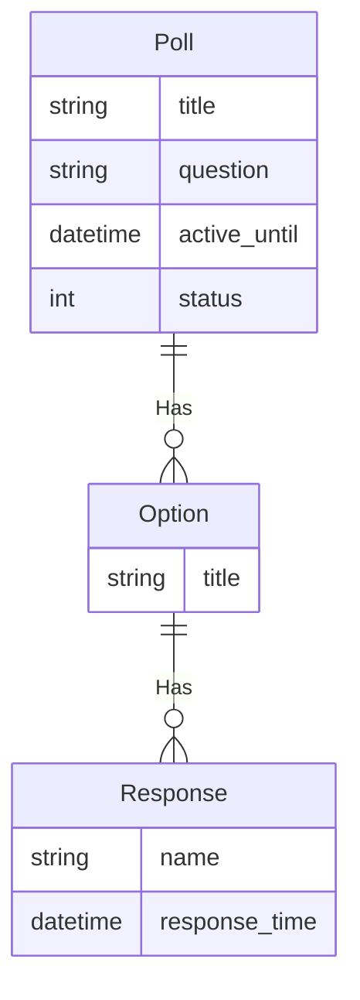

---
# Page title
title: The Poll Project Assignment

# Title for the menu link if you wish to use a shorter link title, otherwise remove this option.
linktitle: The Poll Project

# Date page published
date: 2021-03-23

# Academic page type (do not modify).
type: book

# Position of this page in the menu. Remove this option to sort alphabetically.
weight: 30

draft: False

---

سيكون واجبك الرئيسي هو تعين مشروع استطلاع. من المتوقع ان بشكل فردي على هذا المشروع.

كل اسبوعين سوف تحدد بعض المطلبات التي تحتاج الى اكمال قبل تاريخ الاستحقاق و التقديم من خلال موقعreplit.com

التفاصيل هنا سوف نعطيك فكرة عامة عن المشروع في حالة كنت ترغب في الحصول على بداية مبكرة على العمل على المشروع. كما انني سوف تقدم بعض البقشيش هنا و نحن نتقدم.

## Users
- **User:** الشخص الذي ينشر استطلاعات الرأي.
- **Respondant:** الشخص الذي يستجيب لاستطلاعات الرأي وعرض النتائج.

## Requirements

- [ ] يمكن للمستخدم نشر أسئلة استطلاع الرأي.
- [ ] يمكن أن يكون سؤال الاستطلاع نشطا أو غير نشط.
- [ ] سيكون لسؤال الاستطلاع العنوان والسؤال وتاريخ و الردود.
- [ ] يمكن للمستخدم إنشاء / تحرير / حذف أسئلة الاستطلاع باستخدام واجهة المسؤول.
- [ ] سيعرض موقع الويب قائمة باستطلاعات الرأي النشطة مع ملخص يوضح عدد المشاركين.
- [ ] سيعرض موقع الويب قائمة باستطلاعات الرأي غير النشطة مع ملخص يوضح عدد المشاركين.
- [ ] يعتبر الاستقصاء غير نشط إذا تم تعيينه بشكل صريح إلى غير نشط أو إذا مر تاريخ active_until.

- [ ] يمكن للمستجيبين عرض نتائج الاستطلاع لاستطلاعات الرأي النشطة أو غير النشطة.
- [ ] يمكن للمستجيبين الرد فقط على استطلاعات الرأي النشطة وإلا تم تعطيل الاستطلاع برسالة تظهر أن الاستطلاع غير نشط.
- [ ] خيارات الاستجابة هي خيار متعدد فقط.
- [ ] يمكن للمستجيبين تقديم أسمائهم أو عدم الكشف عن هويتهم.
- [ ] سيتم تسجيل وقت الاستجابة لكل رد.
- [ ] يمكن عرض نتائج الاستقصاء على أنها تعدادات رقمية أو مخطط شريطي أو مخطط دائري.

## ER-Diagram

صف مخطط التقارير الإلكترونية متطلبات البيانات وسيتم استخدامه لإنشاء نماذج بيانات المشروع في models.py .
نموذج بيانات المدونة بسيط جدا حاليا ويحتوي على كيان واحد:

